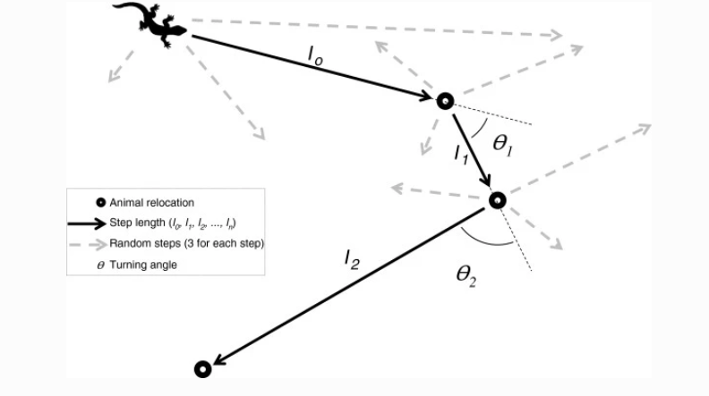

```{r setup}
#| include: false
library(tidyverse)
library(here)

knitr::opts_chunk$set(
  echo = TRUE,
  warning = FALSE,
  message = FALSE,
  fig.height = 4.5,
  fig.width = 4.5
)
```


## Availability matters

- Habitat-selection function assume that each point in the availability domain (e.g., the home range) is available to the animal at any given point in time. 
- This assumption might be met with relatively coarse data (large sampling rates), but the assumption becomes unrealistic for data sets with a higher temporal resolution. 

## Good overviews are

```{r, echo = FALSE, out.width="50%"}
knitr::include_graphics(here("img/northrup.png"))
``` 


```{r, echo = FALSE, out.width="50%"}
knitr::include_graphics(here("img/thurfjell.png"))
``` 

----

For a more statistical review on Step-Selection Functions (SSF) also see

```{r, echo = FALSE, out.width="70%"}
knitr::include_graphics(here("img/michelot2024.png"))
``` 

They point out very nicely how to conceptually separate the SSF (statistical model) from inference (often conditional logistic regression). 

## The basic idea behind an SSF

- Habitat selection is constrained by the movement capacity (i.e., how far can an animal displace within a single time step) and 
- the current position of the animal.

```{r, echo = FALSE, out.width="70%", fig.cap="From Michelot et al. 2024"}
knitr::include_graphics(here("img/michelot2024_fig1.png"))
``` 


## Step-selection function (SSF)

Fortin et al. (2005) introduced the step-selection function as: 

$$
u(s,t+\Delta t) | u(s', t) = \frac{w(X(s); \beta(\Delta t))}{\int_{\tilde{s}\in G}w(X(\tilde{s}, s'); \beta(\Delta t))d\tilde{s}} 
$$

 
- $u(s, t+\Delta t) | u(s', t)$ is conditional probability of finding the individual at location $s$ at time $t+\Delta t$ given it was at location $s'$ at time $t$.        

- $w(X(s); \beta(\Delta t))$ is the exponential selection function, which again is $w(X(s); \beta(\Delta t)) = \exp(\beta_1 x_1(s) + \dots + \beta_kx_k(s))$. 

- The denominator is the full redistribution kernel that is usually approximated through random steps. But see Michelot et al. 2024 for other approaches. 

----

- We can estimate the $\beta$'s using a conditional logistic regression with the R function `clogit()` from the `survival` package. 
- The `amt` package provides a wrapper to this called `fit_ssf()`. 

--- 

## Creating random steps for SSF

We will cover this in much more detail in the R walkthrough. The workflow to fit an SSF in most cases follows the same steps: 

1. Make sure the data are in bursts of regular sampling rates (Note, the $\Delta t$ in the equation). 
2. Create steps (that is converting two consecutive points to a step with a start and end point). 

-----

```{r, echo=FALSE, fig.cap="From Thurfjell et al. 2014"}

```


----

```{r, echo = FALSE}
library(amt)
library(ggplot2)
library(lubridate)

trk <- tibble(
  x = c(0, 0, 1, 1.5, 2, 2, 3, 4, 3), 
  y = c(0, 1, 1, 1.5, 2, 3, 2, 1, 3),
  t = now() + hours(0:8), 
  burst_ = c(1, 1, 1, 1, 2, 2, 2, 2, 2)
)

ggplot(trk, aes(x, y, group = burst_, col = factor(burst_))) + 
  geom_point(size = 3, alpha = 0.4, col = "blue") +
  geom_path(arrow = arrow(length = unit(0.55, "cm"))) +
  theme_minimal() +
  labs(col = "burst_")

```

---------------


```{r, echo = FALSE}
trk1 <- trk |> make_track(x, y, t, burst_ = burst_)
tad <- random_numbers(make_vonmises_distr(kappa = 10), n = 1e4)
sl <- 0.5

stp2 <- steps_by_burst(trk1)
rs1 <- random_steps(stp2, rand_sl = sl, rand_ta = tad, n_control = 25)
ggplot(trk, aes(x, y, group = burst_, col = factor(burst_))) + 
  geom_hline(yintercept = 0, lty = 2, col = "red") +
  geom_path(arrow = arrow(length = unit(0.55, "cm"))) +
  geom_segment(aes(x1_, y1_, xend = x2_, yend = y2_), col = "grey75", data = rs1 |> filter(!case_), inherit.aes = FALSE, alpha = 0.5) +
  geom_point(size = 3, alpha = 0.7, col = "blue") +
  theme_light()


```

----


3. Sample for each observed step $k$ random steps using the distribution from the observed steps and turn angles.

4. Extract covariates at the **end** of steps, and

5. Fit a conditional logistic regression.

------

- Interpretation of parameters can be done exactly the same way as for HSF (previous module and module 5). 
- The relative selection strength (RSS) is how many times more probable it is, to select one step over an other step, when the two steps differ in one covariate at the end of the step.


## Take-home points

- The availability is usually constraint and SSFs allow to model this. 
- Each observed step is paired with random $k$ steps. 
- An observed step and $k$ random steps form a strata.
- We can use conditional logistic regression to estimate the selection coefficients

## The integrated Step-Selection Function (iSSF)

- Forester et al. 2009 suggested to include the step length as an additional covariate to account for the bias that is introduced, because we are sampling from the observed steps. These steps are not independent of habitat selection. 
- Avgar et al. 2016 coined the term **integrated** SSF and showed how commonly used statistical distributions can be used to model the selection-free movement kernel. 


## For background see

```{r, echo = FALSE, out.width="50%"}
knitr::include_graphics(here("img/avgar.png"))
``` 


```{r, echo = FALSE, out.width="50%"}
knitr::include_graphics(here("img/fieberg.png"))
``` 


## iSSF in a bit more detail 

- This adds a further term to the equation we saw before: 


$$
u(s,t+\Delta t) | u(s', t) = \frac{w(X(s); \beta(\Delta t))\phi(s, s'; \gamma(\Delta t))}{\int_{\tilde{s}\in G}w(X(\tilde{s}, s'); \beta(\Delta t))\phi(\tilde{s},s'; \gamma(\Delta t))d\tilde{s}} 
$$
 
- $\phi(s,s'; \gamma(\Delta t))$ is a selection-independent movement kernel that describes how the animal would move in homogeneous habitat.


## Characterizing animal movement (the movement kernel)

- In order to use statistical models to describe the movement process. 
- This is most easily done using statistical distributions for step lengths and turn angles. 


## Distributions in statistics

- Random variables, are variables where each outcome has a probability and these probabilities are often mathematically summarized with functions that are characterized with one or more parameters (=**distributions**). 
- A distribution translates the a possible outcome in a probability, given some parameters.


## Distributions for step lengths

- Suitable distribution for step lengths: Gamma, Exponential, Half Normal, Weibull and possibly others. 
- We will use the Gamma distribution.
- The Gamma distribution has two parameters: shape and scale.

---

```{r, echo = FALSE, out.width="100%"}
xs <- seq(0.5, 200, 0.5)
params <- expand_grid(shape = c(2, 5, 10, 15, 20), scale = c(2, 5, 8))
params %>% mutate(
  data = map2(shape, scale, ~
                tibble(
                  x = xs, 
                  pdf = dgamma(xs, shape = .x, scale = .y)))) %>% 
  unnest(cols = data) %>% 
  mutate(
    scale_lab = paste0("scale = ", scale),
    shape_lab = factor(shape)
    ) %>% 
  ggplot(aes(x, pdf, col = shape_lab)) + 
  geom_line() + 
  facet_grid(. ~ scale_lab, scale = "free") +
  theme(legend.position = "bottom") + 
  labs(x = "step length", col = "shape", col = "shape")
```

-------

## Distributions for turn angles

- For turn angles we need a wrapped distribution. 
- A typical distributions are the von Mises or the wrapped Cauchy distribution. 


## Parameters may change

- Parameters for step-length distribution and turn-angle distribution can change, resembling different behavioral states of the animal (e.g., foraging vs. resting). 


```{r, echo = FALSE, fig.cap="Figure from Moll et al. 2021"}
knitr::include_graphics("../img/moll3_part.jpg")
```

## Take-home messages

1. We can use statistical distributions to characterize the movement of animals.
2. Statistical distributions are described using one or more parameters. 
3. Different behavioral states of the animal can be described with different parameter sets.


-----

- We can estimate the selection coefficients ($\beta$'s) and movement related coefficients ($\gamma$'s) again using a conditional logistic regression. 

- But we are restricted to distributions from the exponential family. 
- See Michelot et al. 2024 how this can be relaxed. 


----

Remember how we can characterize movement in discrete time:

```{r, echo=FALSE, fig.cap="From Thurfjell et al. 2014"}

```

----

- Before we sampled random steps from the observed step lengths and turn angles. 
- We replace this step by using statistical distributions (most often Gamma distribution for step lengths and von Mises distribution for turn angles). 


## Creating random steps for iSSFs

We will cover this in much more detail in the R walkthrough. The workflow is usually as follows: 

1. Make sure the data are in bursts of regular sampling rates (Note, the $\Delta t$ in the equation). 
2. Create steps (that is converting two consecutive points to a step with a start and end point). 
3. *Sample for each observed step $k$ random steps using the distribution from the observed steps and turn angles.*
3. Sample for each observed step $k$ random steps **using a statistical distribution fit to the observed steps or turn angles**.
4. Extract covariates at the *end* of steps, and
5. Fit a conditional logistic regression.


## How to include movement?

- Including the habitat independent movement kernel in the model is possible through functions for the step length and turn angles^[see here for details: https://conservancy.umn.edu/bitstream/handle/11299/218272/AppC_iSSA_movement.html].

- For the Gamma distribution the coefficients of the 
  - step length is linked to the scale parameter, and 
  - the log of the step length is linked to the shape parameter. 

- For the von Mises distribution the cosine of the turn angle is linked to the concentration parameter. 

Once the model is fitted to the data, the tentative parameter estimates can be adjusted (more on this in module 4). 


## How many random steps do we need?

- There is no rule of thumb, generally the more random steps the better. 
- Typical number of random steps range from 10 to 100. 
- An easy way to check if the number of random steps is sufficient, is to rerun the analysis several times with increasing an increasing number of random steps and check when estimates stabilize. 


## Take-home points

- SSF can be extended by including movement (**iSSF**). 
- We sample step length and turn angles from fitted statistical distributions. 
- We then include functions of steps in the model. 


## Next: Code walkthrough

1. Simulate a simple SSF and fit an iSSF again. 


