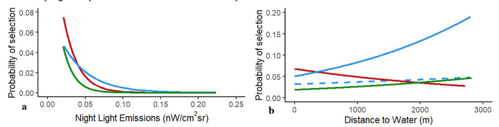

```{r setup}
#| include: false
library(tidyverse)
library(here)
library(amt)
library(terra)

knitr::opts_chunk$set(
  echo = TRUE,
  warning = FALSE,
  message = FALSE,
  fig.height = 4.5,
  fig.width = 4.5
)
```

## Why interpretation can be challenging




## Use-available vs presence abasence

:::: {.columns}

::: {.column width="50%"}

### Use available

We are comparing points that we know the animal used, with points that were available to the animal (maybe they were used maybe not, we do not know). 

:::

::: {.column width="50%"}

### Presence absence

We are comparing points that we know the animal used, with points that we know the animal **did not** use.  

:::

::::

----------

::: {.callout-warning}
For presence-absence designs, we can easily calculate a probability of use, but not for use-available designs. 
:::

:::: {.fragment}


::::


## What can we do instead?

- Calculate relative probability of use (RSS; Relative Selection Strength)
- Look at coefficients, or 
- Use generalized linear hypothesis tests for meaningful comparisons


## Relative Selection Strength (RSS)

We've fitted our HSF/SSF, so we now have estimates for each of the $\beta$ coefficients. If we multiply each coefficient by the value of each habitat variable and add them all up, we get the linear predictor, $g(x)$. Note that we have dropped $\beta_0$.

$$g(x) = \sum_{j=1}^k \beta_j h_j(x)$$

We have estimates for the $\beta$s and the $h$s are data, so we can plug those in and get a value for any $g(x)$.


------

Our habitat selection function, $w(x)$, takes the exponential form in this case.

$$w(x) = exp(g(x))$$

And we know that our intensity of use (in space) is proportional to $w(x)$

$$\lambda(s) \propto w(x(s))$$

**So $w(x)$ is proportional to expected density in that habitat**.


## How do we interpret our fitted HSF?

What does $w(x)$ tell us biologically?

It is proportional to (expected) density by some unknown **constant**, $c$.

Let's see what happens if we take the *ratio* of **densities** in two habitats:

$$\frac{c \times w(x_1)}{c \times w(x_2)}$$


$$\require{cancel} \frac{\cancel{c \times} w(x_1)}{\cancel{c \times} w(x_2)}$$


## Relative Selection Strength (RSS)

Avgar et al. (2017) called this ratio "Relative Selection Strength" (RSS).

$$RSS(x_1, x_2) = \frac{w(x_1)}{w(x_2)}$$


**"how many times more points we expect in habitat $x_1$ than in habitat $x_2$** *if they were equally available."*


## log-RSS

Avgar et al. (2017) also suggested using log-RSS, since $w(x)$ is an exponential function. With a bit of algebra, we can see:

$$log[RSS(x_1, x_2)] = log\left[\frac{w(x_1)}{w(x_2)}\right]$$

$$ = log[w(x_1)] - log[w(x_2)]$$

$$ = g(x_1) - g(x_2) $$

So log-RSS is just the difference in the linear predictors for the two habitats.


## log-RSS

Avgar et al. (2017) also showed that the fitted $\beta$s *are* the log-RSS for a one-unit change in that habitat. 


## log-RSS

Avgar et al. (2017) also showed that the fitted $\beta$s *are* the log-RSS for a one-unit change in that habitat. We can see this in an example with 2 habitat axes. *I.e.*,

$$g(x) = \beta_1 h_1(x) + \beta_2 h_2(x)$$

----------

Let's calculate $log[RSS(x_1, x_2)]$ where the only difference is 1-unit in the first habitat.

$$log[RSS(x_1, x_2)] = g(x_1) - g(x_2)$$

$$ = [\beta_1 h_1(x_1) + \beta_2 h_2(x_1)] - [\beta_1 h_1(x_2) + \beta_2 h_2(x_2)]$$

$$ = \beta_1[h_1(x_1) - h_1(x_2)] + \beta_2[h_2(x_1) - h_2(x_2)]$$ 


## log-RSS

Now plug-in 

$$[h_1(x_1) - h_1(x_2)] = 1$$ 

and 

$$[h_2(x_1) - h_2(x_2)] = 0$$

-----------


$$ \beta_1[h_1(x_1) - h_1(x_2)] + \beta_2[h_2(x_1) - h_2(x_2)]$$ 

$$ = \beta_1[1] + \beta_2[0]$$

$$ = \beta_1$$


## log-RSS

Note that any dimensions along which the habitats are the same have no effect on log-RSS (unless there are interactions in the model, more on that in a future lecture).

Note also that this gives us a way to intuitively think of each individual $\beta$ (again, in models without interactions).

## Take-home messages

- RSS is the most intuitive way to interpret an HSF.
  - "How many times more points we expect in $x_1$ vs. $x_2$."
  
- log-RSS is easier to calculate.
  - It's just the difference in the linear predictor for $x_1$ vs. $x_2$.
  
- The raw $\beta$s themselves are the log-RSS for a one-unit change in that habitat dimension.


- Interpretation:
  - RSS > 1: location 1 preferred
  - RSS < 1: location 2 preferred
  - RSS = 1: no difference

-----


We fitted a simple model to one deer: `fit_ssf(case_ ~ forest + strata(step_id_))`

```{r, echo = FALSE}
set.seed(123)
library(amt)
library(broom)
data(deer)
forest <- get_sh_forest()

m1 <- deer %>% steps_by_burst() %>% random_steps() %>% 
  extract_covariates(forest) %>% 
  fit_ssf(case_ ~ forest + strata(step_id_), model = TRUE)
summary(m1$model)
```
:::: {.fragment}
**Think-pair-share:** Try to give an interpretation on the estimated coefficient for forest.
::::


------


- `forest` indicates if the end of a step is located inside a forest or not.
- $\exp(\beta_1) = \exp(0.56) = 1.75$. This indicates that it is 1.75 times more probably for a step to end in a forest patch than in a non-forest patch. 


-------

As a simulation experiment: 

```{r}
r <- sample(
  c("x1", "x2"),   # The two locations
  1e5, 
  prob = c(
    exp(0.56), # x1 is in the forest; exp(1 * 0.56)
    exp(0) # x2 is not in forest; exp(0 * 0.56)
  ),  
 replace = TRUE)
```

:::: {.fragment}

Tabulate reults

```{r}
(ct <- table(r))
```

::::

:::: {.fragment}
How much more likely is $x_1$ compared to $x_2$:

```{r}
ct[1] / ct[2]
```

::::

-----

The same with the `log_rss()`-functino in `amt`: 

```{r}
x1 <- data.frame(forest = 1)
x2 <- data.frame(forest = 0)
log_rss(m1, x1, x2)$df |> 
  mutate(rss = exp(log_rss))
```

:::: {.fragment}

And we can add confidence intervalls

```{r}
log_rss(m1, x1, x2, ci = "se")$df |> 
  mutate(rss = exp(log_rss), lwr = exp(lwr), upr = exp(upr))
```

::::


-----

### Slightly more complicated models

If we have a continuous variable, lets use distance to forest instead forest/non forest as a binary covariate. 

```{r, echo = FALSE}
set.seed(123)

data("deer")
forest <- get_sh_forest()
forest <- subst(forest, 0, NA)
dforest <- log1p(distance(forest))
names(dforest) <- "dforest"


m1 <- deer %>% steps_by_burst() %>% 
  random_steps() %>% 
  extract_covariates(dforest) %>% 
  fit_ssf(case_ ~ dforest + strata(step_id_), model = TRUE)
summary(m1$model)


```

-----

Now it becomes more interesting to look at range of $x_1$ values and compare them to one **fixed** value of $x_2$. 

```{r}
x1 <- data.frame(
  dforest = 1 
)
x2 <- data.frame(
  dforest = 0 
)

log_rss(m1, x1, x2)$df
```

------------

For visualization it is often interesting to compare $x_2$ to a range of values.

```{r}
x1 <- data.frame(
  dforest = seq(0, 8, 0.1) 
)
x2 <- data.frame(
  dforest = 1 
)

head(log_rss(m1, x1, x2)$df)
```

-------------

Or plot the result

```{r, echo = FALSE}
log_rss(m1, x1, x2)$df |> 
  ggplot(aes(dforest_x1, log_rss)) + 
  geom_line() +
  theme_minimal() +
  labs(x = "Distance to forest (scaled)", y = "log(RSS)") +
  geom_hline(yintercept = 0, lty = 2) + 
  geom_vline(xintercept = 1, col = "red")

```


---------

What happens if we change $x_2$?

```{r, echo = FALSE}
res <- lapply(0:8, function(x) {
  x1 <- data.frame(
  dforest = seq(0, 8, 0.1) 
  )
  x2 <- data.frame(
    dforest = x # the mean distance
  )
  log_rss(m1, x1, x2)$df |> mutate(x2 = x)
})

bind_rows(res) |> 
  ggplot(aes(dforest_x1, log_rss, col = factor(x2))) + 
  geom_line() +
  theme_minimal() +
  labs(x = "Distance to forest (scaled)", y = "log(RSS)", 
       col = "Reference value (x_2)") +
  geom_hline(yintercept = 0, lty = 2) 

```


---------------

If we assume that habitat selection differs between day and night for this one deer, we will have to add  an interactions between the continouos distance to forest and time of day (categorical).  

```{r, echo = FALSE}
m1 <- deer %>% steps_by_burst() %>% 
  random_steps() %>% 
  extract_covariates(dforest) %>% 
  time_of_day() |> mutate(night = as.numeric(tod_end_ != "day")) |> 
  fit_ssf(case_ ~ dforest + dforest:night + strata(step_id_), model = TRUE)
summary(m1$model)
```

-----------

The basic principle remains the same (we define $x_1$ and $x_2$): 


```{r}
x1 <- data.frame( # different distances during the day
  dforest = seq(0, 8, 0.1), 
  night = 1 
)
x2 <- data.frame(
  dforest = 1, 
  night = 1
)

head(log_rss(m1, x1, x2)$df)
```

-------


```{r}
x1 <- expand.grid( # different distances during the night
  dforest = seq(0, 8, 0.1), 
  night = 0:1
)
x2 <- data.frame(
  dforest = 1, 
  night = 0
)

head(log_rss(m1, x1, x2)$df)
```

-------------

```{r, echo = FALSE}
x1 <- expand.grid( # different distances during the night
  dforest = seq(0, 8, 0.1), 
  night = 0:1
)
x2 <- data.frame(
  dforest = 1, 
  night = 0
)

log_rss(m1, x1, x2)$df |> 
  mutate(day = ifelse(night_x1 == 1, "night", "day")) |> 
  ggplot(aes(dforest_x1, log_rss, col = factor(day))) + 
  geom_line() +
  theme_minimal() +
  labs(x = "Distance to forest (scaled)", y = "log(RSS)", 
       col = "Time of day") +
  geom_hline(yintercept = 0, lty = 2) 
  
```

What is the reference value?

--------- 

:::: {.columns}

::: {.column width="70%"}


Let us zoom in a bit


```{r, echo = FALSE}
x1 <- expand.grid( # different distances during the night
  dforest = seq(0.5, 1.5, 0.1), 
  night = 0:1
)
x2 <- data.frame(
  dforest = 1, 
  night = 0
)

log_rss(m1, x1, x2)$df |> 
  mutate(day = ifelse(night_x1 == 1, "night", "day")) |> 
  ggplot(aes(dforest_x1, log_rss, col = factor(day))) + 
  geom_line() +
  theme_minimal() +
  labs(x = "Distance to forest (scaled)", y = "log(RSS)", 
       col = "Time of day") +
  geom_hline(yintercept = 0, lty = 2) 

```

:::

::: {.column width="30%"}

:::: {.fragment}

This acutall what we expect: 

```{r}
coef(m1$model)[2]

```


::::

:::

::::

----------


Maybe its better to have a reference value for day/night:


```{r, echo = FALSE}
x1 <- expand.grid( # different distances during the night
  dforest = seq(0, 8, 0.1), 
  night = 0
)
x2 <- data.frame(
  dforest = 1, 
  night = 0
)

n <- log_rss(m1, x1, x2)$df |> mutate(tod = "day")

x1 <- expand.grid( # different distances during the night
  dforest = seq(0, 8, 0.1), 
  night = 1
)
x2 <- data.frame(
  dforest = 1, 
  night = 1
)

d <- log_rss(m1, x1, x2)$df |> mutate(tod = "night")

bind_rows(n, d) |> 
  ggplot(aes(dforest_x1, log_rss, col = tod)) + 
  geom_line() +
  theme_minimal() +
  labs(x = "Distance to forest (scaled)", y = "log(RSS)", 
       col = "Time of day") +
  geom_hline(yintercept = 0, lty = 2) 
  
```

## Coefficients

For more complex models, it is sometimes sufficient to look at only the coefficients (and the sign of the coefficients). 

```{r}
m1$model
```

--------

```{r, echo = FALSE}
tidy(m1$model, conf.int = TRUE) |> 
  ggplot(aes(term, estimate)) + 
  geom_pointrange(aes(ymin = conf.low, ymax = conf.high)) +
  geom_hline(yintercept = 0, lty = 2) +
  theme_minimal() 
```


## Generalized Linear Hypothesis Tests

```{r}
library(multcomp)
summary(glht(
  m1$model, c("dforest = 0", # day, 
              "dforest + dforest:night = 0") # night
))
```

--------------

```{r, echo = FALSE}
tidy(glht(
  m1$model, c("dforest = 0", # day, 
              "dforest + dforest:night = 0") # night
), conf.int = TRUE) |> 
  ggplot(aes(contrast, estimate)) + 
  geom_pointrange(aes(ymin = conf.low, ymax = conf.high)) +
  geom_hline(yintercept = 0, lty = 2) +
  theme_minimal() 
```
