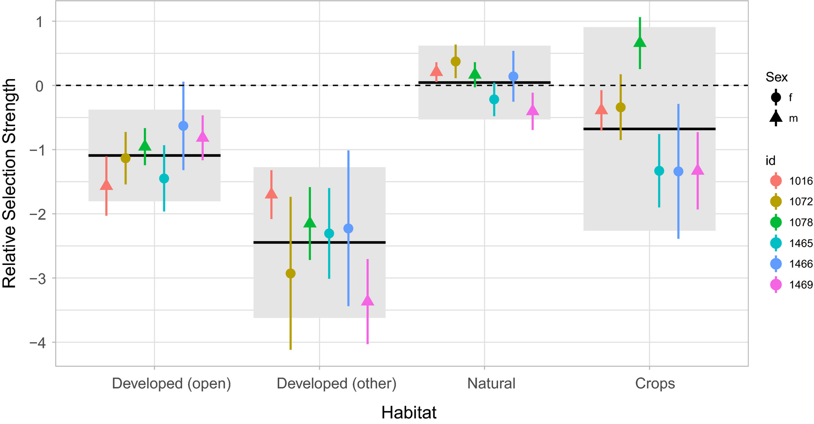
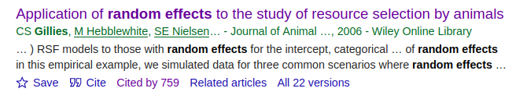
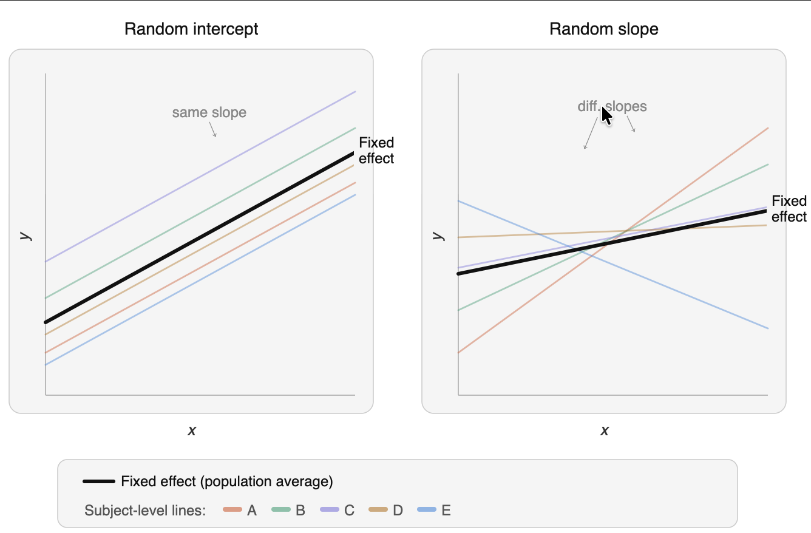
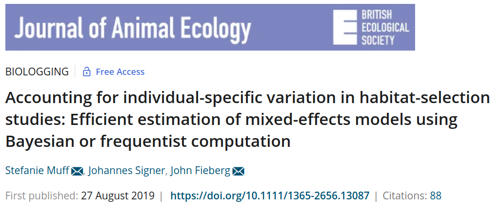
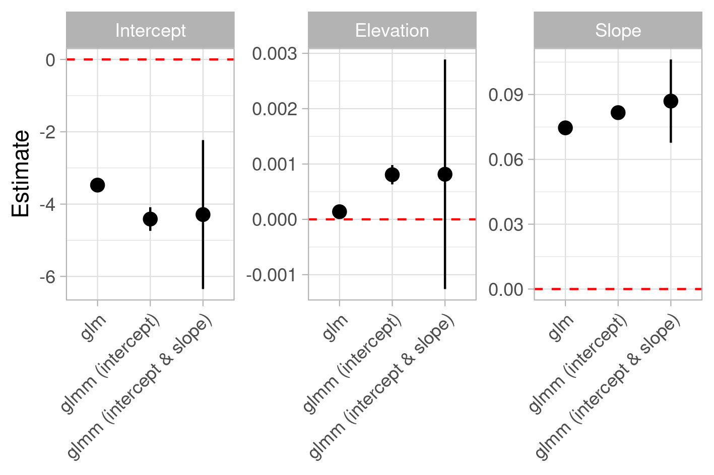
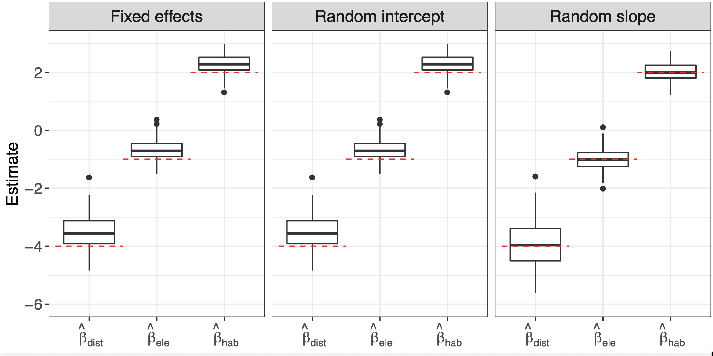
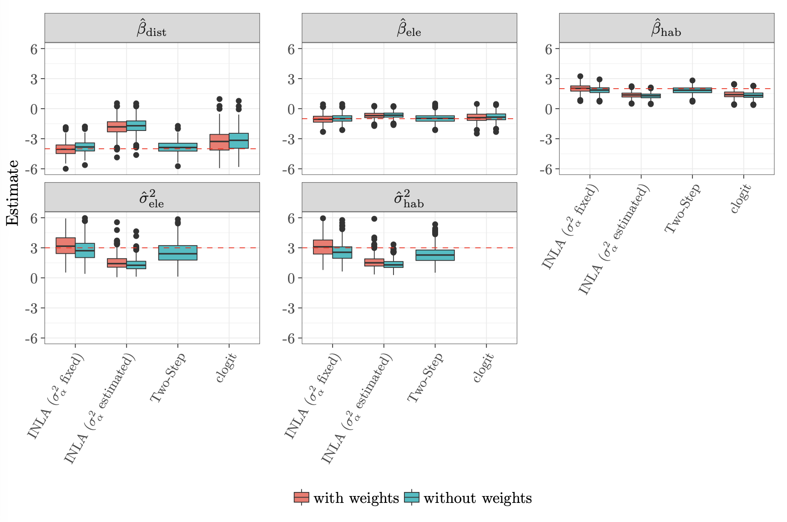
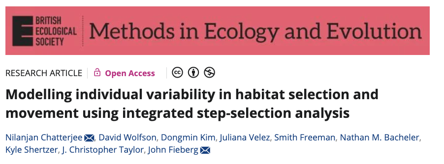
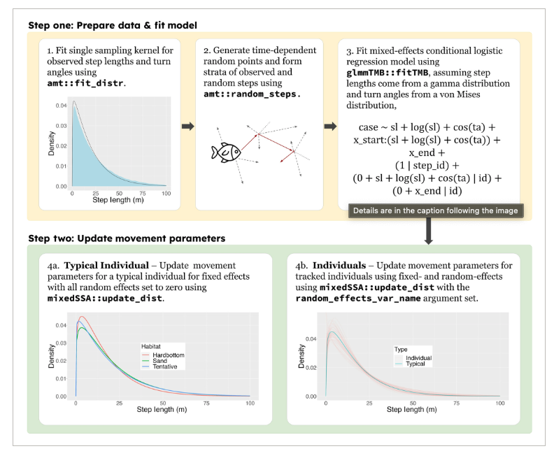
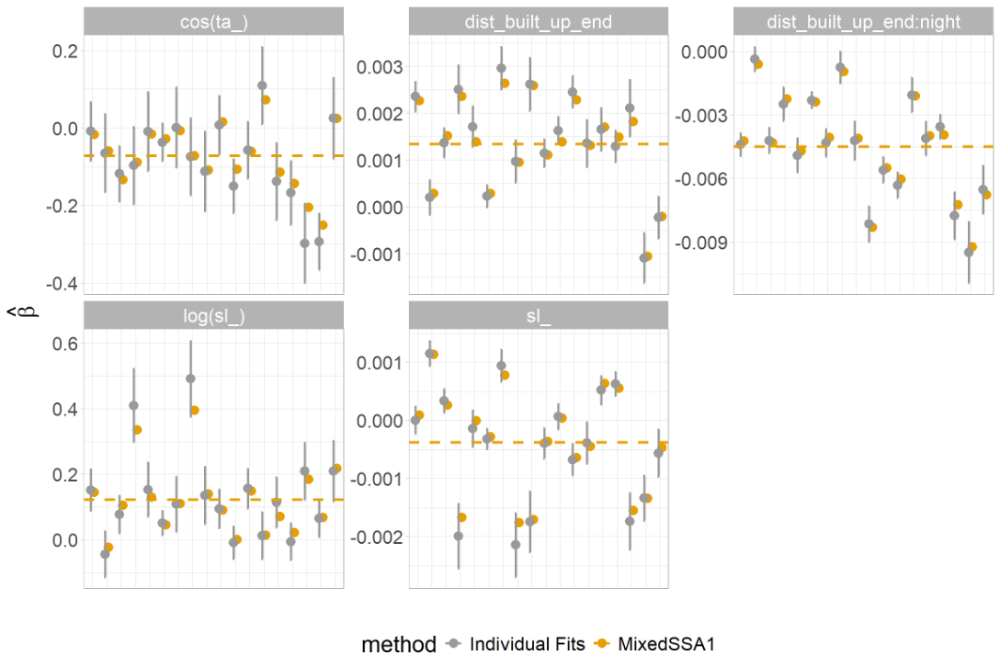

```{r setup}
#| include: false
library(tidyverse)

knitr::opts_knit$set(
  root.dir = here::here("06 Mixed/")
)

knitr::opts_chunk$set(
  echo = TRUE,
  warning = FALSE,
  message = FALSE,
  fig.height = 4.5,
  fig.width = 4.5
)
```


## Why should we care?

-   Most telemetry studies have data from many animals.
-   Often individual behave very different (and we can fully account for these differences in a model).
-   We are often interested in population-level effects (i.e., how would an average animal behave).

## How-to account for individual differences

1.  *Ignore individuals and fit data to all animals.*
2.  **Two-Step approach**: Fit individual models to each individual (or instance) and summarize population-level characteristics during a second step (i.e., use individual-specific parameter estimates as data).
3.  **Mixed/hierarchical/random-effect models**: Obtain individual-specific parameter estimates from one single model

## Two-step approach

-   A somewhat naive approach could be, to fit to each individual animal the model of interests (e.g., a SSF or an iSSF).

-   In a next step we can then "do statistics" with the coefficients of the individual model. For example, we could

    -   calculate the mean and confidence intervals to obtain population level effects, or
    -   use a linear models to relate coefficient values to other explanatory covariates.

-   A difficulty is if we have extreme observations or some levels of a categorical covariate is not observed for all animals.

------------------------------------------------------------------------

There are different programming strategies, how one could approach such a situation:

a.  *Write customized code for each individual.*
b.  Use some kind of looping structure (for example a `for`-loop).
c.  Use a nest-unnest approach, as we have seen previously (for example with the `purrr` package; see [module 7](https://github.com/jmsigner/movement_ecology_1/tree/main/07%20Multiple%20Instances) of the first part of this course).

## Example 1

An example of this approach was used in Signer et al. 2019

```{r, echo = FALSE, fig.cap="Source Signer et al. 2019"}

```

## Example 2


------------------------------------------------------------------------

## 3. Use a mixed-model strategy.

-   For HSF this is *relatively* straight forward. We can make use of well established tools that were developed for GLMMs.

-   For iSSFs this is slightly more challenging. We have to use a likelihood equivalent reformulation of the iSSF as a poisson regression with random effects for each strata with a fixed large variance.

------------------------------------------------------------------------

## Random effects for HSFs

-   Random effects were proposed for HSFs over 15 years ago[^1].

[^1]: Gillies et al. "Application of random effects to the study of resource selection by animals." Journal of Animal Ecology 75.4 (2006): 887-898.

```{r, echo = FALSE, out.width="80%"}

```

-   Majority of studies between 2016 and 2020 (80 %) only include random intercept and no random slope(s).

## Reminder: random intercept vs random slope



------------------------------------------------------------------------

Muff et al. 2020 had another look at model specifications for RSFs/HSFs and extended this also to iSSFs.



------------------------------------------------------------------------

## A case study for HSF/RSF

```{r, echo = FALSE}
knitr::read_chunk(here::here("06 Mixed/additional_scripts/goats.R"))
```

-   Data on habitat selection of Mountain Goats\footnotemark[3]
-   Generalized linear model with binomial response (GLM), random intercept (GLMM 1), and random intercept and slopes (GLMM 2).

\footnotetext[3]{Lele \& Keim, (2006) Weighted distributions and estimation of resource selection probability functions. Ecology 87, 3021–3028.}

------------------------------------------------------------------------

Let us fit three models to tracking data from wild goats:

```{r, eval = FALSE}
<<goat.models>>
```

------------------------------------------------------------------------

Comparing the model coefficients:



For RSF use random intercept **and** random slope(s)\footnotemark[4].

\footnotetext[4]{Schielzeth, \& Forstmeier. "Conclusions beyond support: overconfident estimates in mixed models." Behavioral Ecology 20.2 (2008): 416-420.}

------------------------------------------------------------------------

### A random intercept only model, is problematic because:

-   the intercept in RSFs is not of interest (module 2) and depends on the sampling ratio of used versus available points.
-   SEs will typically be too small without random coefficients (e.g., [Schielzeth and Forstmeier 2009](https://academic.oup.com/beheco/article/20/2/416/218997)).
-   it does not account for within-individual statistical dependence (i.e., autocorrelation in locations).

------------------------------------------------------------------------

## Accounting for animal-specific variation (SSF)

```{=html}
<!---
\only<1->{ Conditional logistic regression with random effects is more difficult

\begin{equation*} 
\text{P}(y_{ntj}=1 \,|\, \pmb{x}_{nt\cdot}) = \pi_{ntj} = 
\frac{\exp( \pmb\beta^\top \pmb{x}_{ntj})}
{\sum_{j = 1}^J \exp( \pmb\beta^\top \pmb{x}_{nti})}  
\end{equation*}}
    
- $n = 1, \dots, N$ individuals, with realized steps, 
- time points $t = 1, \dots, T_n$, with 
- $j = 1, \dots, J_{n,t}$ location that were either used or available. 

--->
```

-   Conditional logistic regression with random effects is more difficult.
-   The conditional logistic regression is a special case of the multinomial model.
-   The multinomial model is likelihood-equivalent to the Poisson model.
-   Thus we can rewrite the conditional logistic regression as a Poisson regression.

------------------------------------------------------------------------

## SSF as poisson model

Reformulation as Poisson model\footnotemark[5] \footnotemark[6]

$$
\text{E}(y_{nti}) = \mu_{nti} = \exp(\alpha_{nt} + \pmb\beta^\top \pmb{x}_{nti} + \pmb{u}^\top \pmb{z}_{nti}) \ ,\quad y_{nti} \sim \text{Po}(\mu_{nti})
$$

-   $\alpha_{nt} \sim N(0, \sigma_\alpha^2)$ are the stratum specific intercepts with $\sigma_{\alpha}^2$ being fixed at a very large value.
-   $\pmb\beta^\top \pmb{x}_{nti}$ are the selection coefficients and the design matrix, respectively.
-   $\pmb{u}^\top \pmb{z}_{nti}$ specify the random effect structure.

\footnotetext[5]{Armstrong et al. "Conditional Poisson models: a flexible alternative to conditional logistic case cross-over analysis." BMC medical research methodology 14.1 (2014): 122.}
\footnotetext[6]{Muff, S., et al. "Accounting for individual‐specific variation in habitat‐selection studies: Efficient estimation of mixed‐effects models using Bayesian or frequentist computation". Journal of Animal Ecology, (2020): 89(1), 80-92.}

------------------------------------------------------------------------

## Simulation study from Muff et al. 2020

-   Simulation of movement for 20 animals with animal-specific selection coefficients.
-   For RSFs sample random points within the availability domain
-   For SSFs sample random steps from each location

------------------------------------------------------------------------

## Results HSF



------------------------------------------------------------------------

## Results SSF



------------------------------------------------------------------------

## Software to fit these models

-   HSF/RSF:
    -   Any standard software package that can fit GLMMs is suitable.
-   iSSF:
    -   Frequentist: In R the package `glmmTMB` can be use, because it allows to fix the variance of random effects.
    -   Muff et al. 2020 primarily used a Bayesian approach (INLA), as it straightforward to fix the variance.

------------------------------------------------------------------------

## How-to model movement in a mixed-effect context:



------------------------------------------------------------------------

From Chatterjee et al. 2024:



------------------------------------------------------------------------

Comparing mixed vs individual model approach for SSFs



## Next: Code walkthrough
