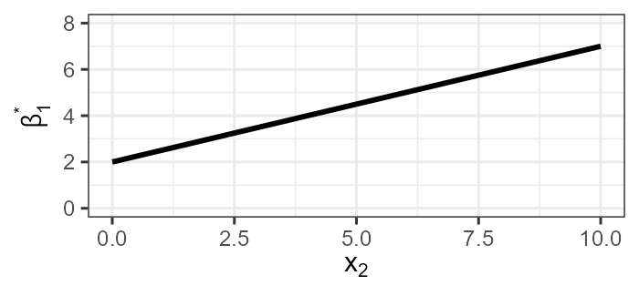
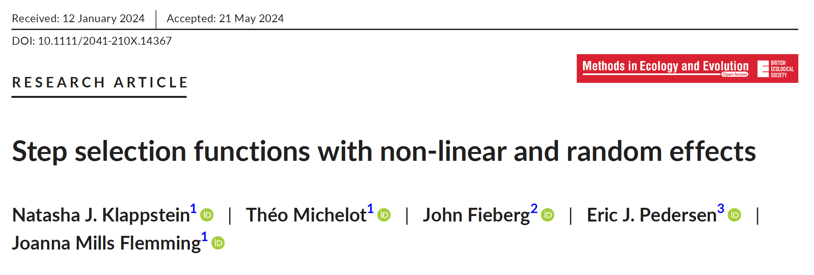
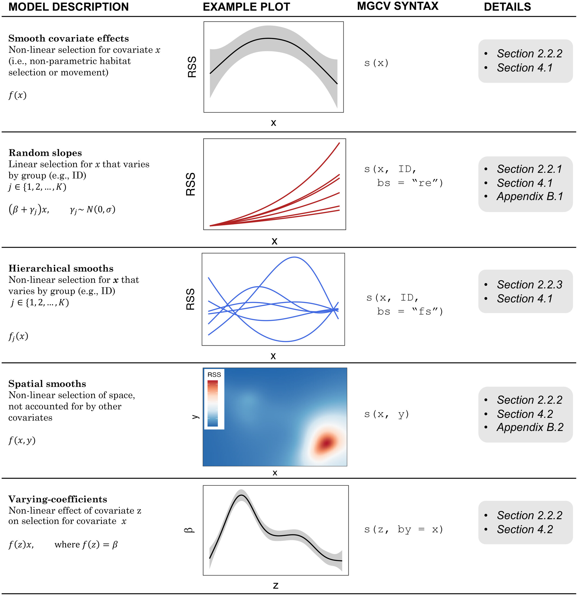
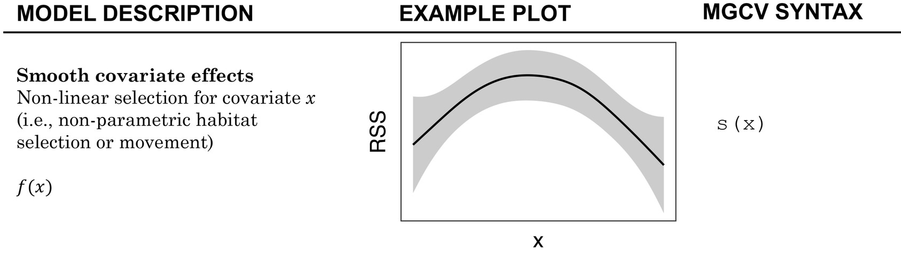
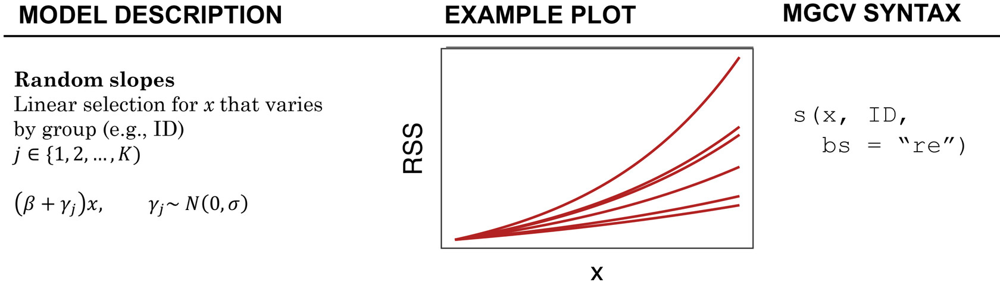
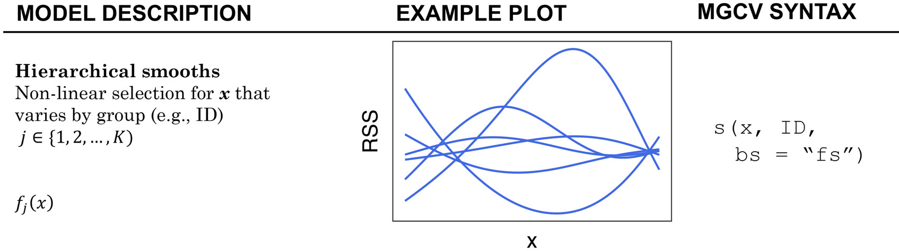
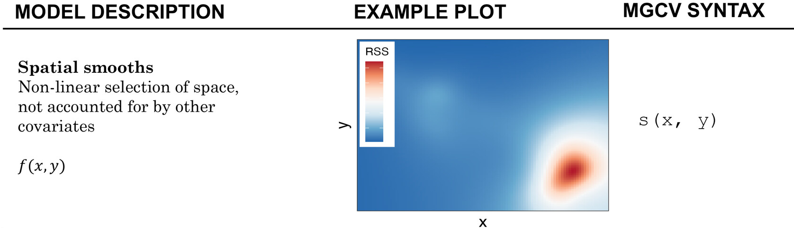
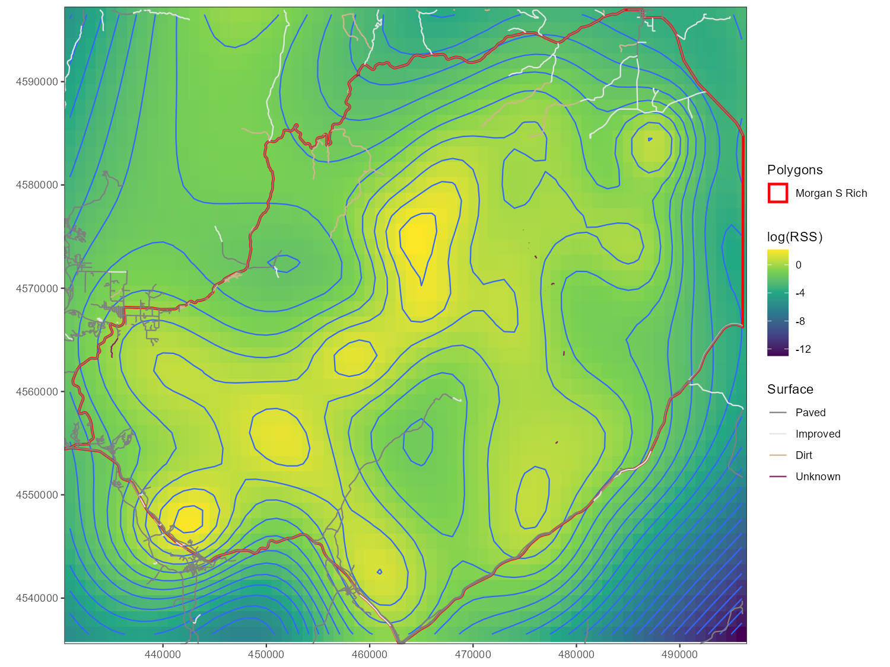
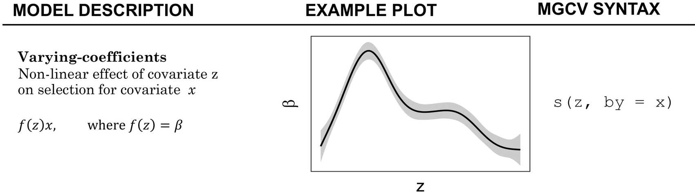
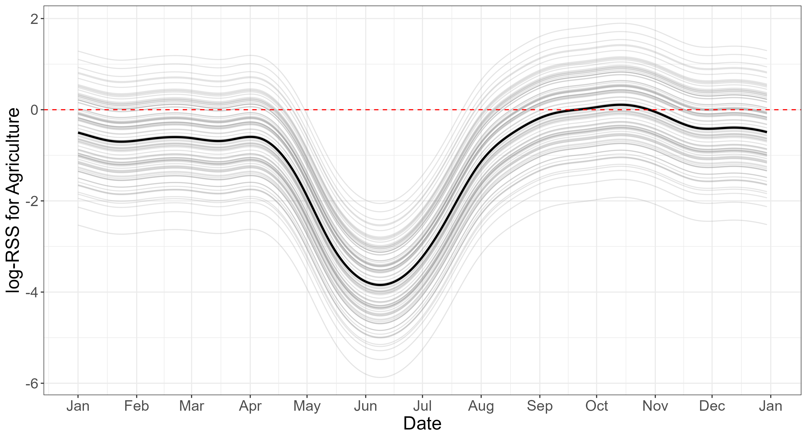

## SSFs with GAMs

:::: {.columns}

::: {.column width=45%}

- In module 4 (SSFs, part 2), we used interactions in our models to allow selection to vary as a *function* of another covariate.
  - We used linear functions.
  - We used quadratic functions.
- Now, we want to generalize that further and *estimate the function*.

:::

::: {.column width=5%}

:::

::: {.column width=45%}

</br>

<center>

</center>

:::

::::

## SSFs with GAMs

### Outline

:::: {.columns}

::: {.column width=45%}
- Intro to GAMs
  - Estimating unknown functions
  - Basis expansions
  - Penalizing complexity
  
:::

::: {.column width=5%}

:::

::: {.column width=45%}
- SSFs with GAMs
  - Nonlinear selection
  - Random slopes
  - Spatial "random effects" (*e.g.*, Gaussian process models)
  - Time-varying selection
  
:::

::::
  
# Estimating Unknown Functions

## General Setup for GAMs

</br>

The goal with a GAM is to estimate an **unknown function** that relates the mean of the random variable to covariates.

$$\mu = f(x)$$
$$y \sim Normal(\mu, \sigma^2)$$

If we want to use standard regression methods to estimate $f$, then we want to represent it such that the equation above becomes a linear model.

## General Setup for GAMs

</br>

We can do this by choosing a [**basis**](https://en.wikipedia.org/wiki/Basis_(linear_algebra)){target="blank"} of which $f$ (or an approximation of $f$) is an element.

</br>

That is, we should choose a **basis** that is made of [**basis functions**](https://en.wikipedia.org/wiki/Basis_function) that can approximate nearly any smooth function.

</br>

Each of those basis functions gets weighted with a coefficient (i.e., a $\beta$) and summed together to represent $f$.

# Basis Expansions

## Basis Expansions

</br>

A **basis** you are probably already familiar with is polynomials.

</br>

The basis functions for a polynomial basis take the form:

$$x^k ; k \ge 0$$

## Basis Expansions

</br>

A **basis** you are probably already familiar with is polynomials.

</br>

The basis functions for a polynomial basis take the form:

$$x^k ; k \ge 0$$

So a polynomial basis expansion with two basis functions would be:

$$\beta_0 x^0 + \beta_1 x^1 = \beta_0 +\beta_1 x$$


## Basis Expansions

</br>

A **basis** you are probably already familiar with is polynomials.

</br>

The basis functions for a polynomial basis take the form:

$$x^k ; k \ge 0$$

So a polynomial basis expansion with two basis functions would be:

$$\beta_0 x^0 + \beta_1 x^1 = \beta_0 +\beta_1 x$$

And a polynomial basis expansion with four basis functions would be:

$$\beta_0 x^0 + \beta_1 x^1 + \beta_2 x^2 + \beta_3 x^3$$

## Basis Expansions

- Consider these data I simulated (i.e., I know the true generating function). 
- We can fit an ordinary linear model to these data, using polynomial basis expansions.

```{r}
#| echo: false
#| fig-align: center
#| lightbox: true

# Set color palette
palette("dark2")

# Set Seed
set.seed(20260211 * 4)

# Generate predictor
x <- runif(n = 500, min = -1, max = 1)

# Complex function
my_fun <- function(x) {
  return(sin(8 * x) + 2 * x^2 + -2 * x + 2)
}

# Calculate mean
mu <- my_fun(x)

# Generate response
y <- rnorm(n = length(x), mean = mu, sd = 0.5)

plot(x, y)

```

## Basis Expansions

```{r}
#| echo: true
#| code-fold: true
#| fig-align: center
#| lightbox: true

poly1 <- lm(y ~ x)

plot(x, y, main = "First Order Polynomial",
     sub = expression(y == beta[0] + beta[1]*x))
abline(poly1, col = 1, lwd = 2)

```

## Basis Expansions

```{r}
#| echo: true
#| code-fold: true
#| fig-align: center
#| lightbox: true

poly2 <- lm(y ~ x + I(x^2))

plot(x, y, main = "Second Order Polynomial",
     sub = expression(y == beta[0] + beta[1]*x + beta[2]*x^2))
pred2 <- data.frame(x = seq(-1.2, 1.2, length.out = 200))
pred2$y <- predict(poly2, newdata = pred2)
lines(pred2$x, pred2$y, col = 2, lwd = 2)

```

## Basis Expansions

```{r}
#| echo: true
#| code-fold: true
#| fig-align: center
#| lightbox: true

poly3 <- lm(y ~ x + I(x^2) + I(x^3))

plot(x, y, main = "Third Order Polynomial",
     sub = expression(y == beta[0] + beta[1]*x + beta[2]*x^2 + beta[3]*x^3))
pred3 <- data.frame(x = seq(-1.2, 1.2, length.out = 200))
pred3$y <- predict(poly3, newdata = pred3)
lines(pred3$x, pred3$y, col = 3, lwd = 2)

```

## Basis Expansions

```{r}
#| echo: true
#| code-fold: true
#| fig-align: center
#| lightbox: true

poly6 <- lm(y ~ x + I(x^2) + I(x^3) + I(x^4) + I(x^5) + I(x^6))

plot(x, y, main = "Sixth Order Polynomial",
     sub = expression(y == beta[0] + beta[1]*x + beta[2]*x^2 + beta[3]*x^3 + beta[4]*x^4 + beta[5]*x^5 + beta[6]*x^6))
pred6 <- data.frame(x = seq(-1.2, 1.2, length.out = 200))
pred6$y <- predict(poly6, newdata = pred6)
lines(pred6$x, pred6$y, col = 4, lwd = 2)

```

## Basis Expansions

```{r}
#| echo: true
#| code-fold: true
#| fig-align: center
#| lightbox: true

poly10 <- lm(y ~ poly(x, 10))

plot(x, y, main = "Tenth Order Polynomial",
     sub = expression(y == beta[0] + beta[1]*x + beta[2]*x^2 + beta[3]*x^3 + beta[4]*x^4 + beta[5]*x^5 + beta[6]*x^6 + beta[7]*x^7 + beta[8]*x^8 + beta[9]*x^9 + beta[10]*x^10))
pred10 <- data.frame(x = seq(-1.2, 1.2, length.out = 200))
pred10$y <- predict(poly10, newdata = pred10)
lines(pred10$x, pred10$y, col = 5, lwd = 2)

```

## Basis Expansions

```{r}
#| echo: true
#| code-fold: true
#| fig-align: center
#| lightbox: true

poly25 <- lm(y ~ poly(x, 25))

plot(x, y, main = "Twenty-fifth Order Polynomial",
     sub = expression(y == beta[0] + beta[1]*x + beta[2]*x^2 + ... + beta[24]*x^24 +beta[25]*x^25))
pred25 <- data.frame(x = seq(-1.2, 1.2, length.out = 200))
pred25$y <- predict(poly25, newdata = pred25)
lines(pred25$x, pred25$y, col = 6, lwd = 2)

```

## Basis Expansions

```{r}
#| echo: false
#| fig-align: center
#| lightbox: true

plot(x, y, main = "Polynomial Basis")
lines(pred25$x, pred25$y, col = 6, lwd = 2)
lines(pred25$x, pred10$y, col = 5, lwd = 2)
lines(pred25$x, pred6$y, col = 4, lwd = 2)
lines(pred25$x, pred3$y, col = 3, lwd = 2)
lines(pred25$x, pred2$y, col = 2, lwd = 2)
abline(poly1, col = 1, lwd = 2)
legend("topright", legend = c(1, 2, 3, 6, 10, 25), title = "Degree",
       lty = 1, lwd = 2, col = 1:6, ncol = 3)

```

## Basis Expansions

</br>

You may have noticed two things along the way here.

1. The higher degree polynomials predict extreme values at the edges.
2. We didn't get much improvement from a 10th-degree polynomial to a 25th-degree polynomial, even though we estimated an extra 15 parameters.

## Basis Expansions

While we use them all the time, polynomial basis expansions aren't actually all that great for our problem.

- They often predict extreme values with small **extrapolations**.
- They can oscillate wildly in between data points (so can be bad for **interpolation**).

```{r}
#| echo: false
#| fig-align: center
#| lightbox: true

plot(x, y, main = "Polynomial Basis", 
     xlim = c(-1.2, 1.2), ylim = c(-4, 10))
lines(pred25$x, pred25$y, col = 6, lwd = 2)
lines(pred25$x, pred10$y, col = 5, lwd = 2)
lines(pred25$x, pred6$y, col = 4, lwd = 2)
lines(pred25$x, pred3$y, col = 3, lwd = 2)
lines(pred25$x, pred2$y, col = 2, lwd = 2)
abline(poly1, col = 1, lwd = 2)
legend("top", legend = c(1, 2, 3, 6, 10, 25), title = "Degree",
       lty = 1, lwd = 2, col = 1:6, ncol = 3)
```

## Basis Expansions

We need some method to obtain *parsimony*. Just from the eye test, it doesn't seem like it's worth it to use a 25th-degree polynomial over a 10th-degree polynomial.

```{r}
#| echo: false
#| fig-align: center
#| lightbox: true

plot(x, y, main = "Polynomial Basis")
lines(pred25$x, pred25$y, col = 6, lwd = 2)
lines(pred25$x, pred10$y, col = 5, lwd = 2)
legend("top", legend = c(10, 25), title = "Degree",
       lty = 1, lwd = 2, col = 5:6, ncol = 2)
```

## Basis Expansions

</br>

You may have noticed two things along the way here:

- The higher degree polynomials predict extreme values at the edges.
  - *Solution*: spline basis  
- We didn't get much improvement from a 10th-degree polynomial to a 25th-degree polynomial, even though we estimated an extra 15 parameters.
  - *Solution*: penalize for complexity with a smoothing parameter

# Splines

## Cubic Regression Splines {.smaller}

- A [**spline**](https://en.wikipedia.org/wiki/Spline_(mathematics)){target="blank"} is just a set of weighted basis functions. Splines are constructed from piecewise functions that fit together smoothly (without sharp edges).
- It turns out, **cubic splines** are the smoothest possible interpolants through any set of data. (See Chapter 5, p. 197 of Wood 2017). **Cubic splines** are sections of cubic polynomials *between every data point*.
- **Cubic *regression* splines** are sections of cubic polynomial, defined piecewise between user-defined **knots**.

```{r}
#| echo: false
#| fig-align: center
#| lightbox: true

library(mgcv)
library(gratia)
library(ggplot2)

dat <- data.frame(x = x, y = y)

bfun <- basis(s(x, bs = "cr"), data = dat)
knots <- data.frame(x = smoothCon(s(x, bs = "cr"), 
                                  data = dat)[[1]]$xp,
                    y = 0)
ggplot() +
  geom_line(data = bfun, 
            aes(x = x, y = .value, group = .bf, color = .bf), linewidth = 1) +
  geom_point(data = knots, aes(x = x, y = y, fill = "Knots"),
             size = 7, shape = 21) +
  xlab("x") +
  ylab("y") +
  ggtitle("Cubic Regression Spline Basis with 10 knots") +
  scale_color_discrete(name = "Basis\nFunction") +
  scale_fill_manual(name = "Knots", values = "#00000020") +
  theme_classic()

```

## Cubic Regression Splines

Here are the 10 basis functions plotted separately:

```{r}
#| echo: false
#| fig-align: center
#| lightbox: true

ggplot() +
  facet_wrap(~.bf) +
  geom_line(data = bfun, 
            aes(x = x, y = .value, group = .bf, color = .bf), linewidth = 1) +
  xlab("x") +
  ylab("y") +
  scale_color_discrete(name = "Basis\nFunction") +
  theme_classic()

```

## Cubic Regression Splines

We can give each one a weight (a $\beta$ coefficient) and sum them up. For example, we can weight all 10 with $\beta_i = 1$.

```{r}
#| echo: false
#| code-fold: false
#| lightbox: true
#| fig-align: center

library(dplyr)

ex_1 <- bfun %>% 
  group_by(x) %>% 
  summarize(y = sum(.value))

ggplot() +
  geom_line(data = bfun, 
            aes(x = x, y = .value, group = .bf, color = .bf), linewidth = 1) +
  geom_line(data = ex_1, aes(x = x, y = y), linewidth = 2) +
  scale_color_discrete(name = "Basis\nFunction") +
  ylab("y") +
  theme_classic()

```

## Cubic Regression Splines

We can alternate $\beta$s between -1 and + 1.

```{r}
#| echo: false
#| code-fold: false
#| lightbox: true
#| fig-align: center

library(dplyr)

bfun_2 <- bfun %>% 
  mutate(w = case_when(
    as.numeric(.bf) %% 2 == 0 ~ -1,
    TRUE ~ 1
  ),
  val = .value * w)

ex_2 <- bfun_2 %>% 
  group_by(x) %>% 
  summarize(y = sum(val))

ggplot() +
  geom_line(data = bfun_2, 
            aes(x = x, y = val, group = .bf, color = .bf), linewidth = 1) +
  geom_line(data = ex_2, aes(x = x, y = y), linewidth = 2) +
  ylab("y") +
  scale_color_discrete(name = "Basis\nFunction") +
  theme_classic()

```

## Cubic Regression Splines

We can try a bunch of other values, like this:

| $\beta_1$ | $\beta_2$ | $\beta_3$ | $\beta_4$ | $\beta_5$ | $\beta_6$ | $\beta_7$ | $\beta_8$ | $\beta_9$ | $\beta_{10}$ |
|---------|-----------|-----------|-----------|--------------|----------------|-----------|-----------|-----------|--------------|
| 5 | -2 | -3 | - 5 | 1 | 2 | 4 |2 | 0 | -3 |

```{r}
#| echo: false
#| code-fold: false
#| lightbox: true
#| fig-align: center

library(dplyr)

bfun_3_key <- data.frame(.bf = factor(1:10),
                         w = c(5, -2, -3, -5, 1, 2, 4, 2, 0, -3))

bfun_3 <- bfun %>% 
  left_join(bfun_3_key, by = ".bf") %>% 
  mutate(val = .value * w)

ex_3 <- bfun_3 %>% 
  group_by(x) %>% 
  summarize(y = sum(val))

ggplot() +
  geom_line(data = bfun_3, 
            aes(x = x, y = val, group = .bf, color = .bf), linewidth = 1) +
  geom_line(data = ex_3, aes(x = x, y = y), linewidth = 2) +
  ylab("y") +
  scale_color_discrete(name = "Basis\nFunction") +
  theme_classic()

```

## Cubic Regression Splines

We can try evenly spaced $\beta$s, for example, ranging from 0 to 2. 
```{r}
#| echo: false
#| code-fold: false
#| lightbox: true
#| fig-align: center

library(dplyr)

bfun_4_key <- data.frame(.bf = factor(1:10),
                         w = seq(0, 2, length.out = 10))

bfun_4 <- bfun %>% 
  left_join(bfun_4_key, by = ".bf") %>% 
  mutate(val = .value * w)

ex_4 <- bfun_4 %>% 
  group_by(x) %>% 
  summarize(y = sum(val))

ggplot() +
  geom_line(data = bfun_4, 
            aes(x = x, y = val, group = .bf, color = .bf), linewidth = 1) +
  geom_line(data = ex_4, aes(x = x, y = y), linewidth = 2) +
  ylab("y") +
  scale_color_discrete(name = "Basis\nFunction") +
  theme_classic()

```

# Smoothing

## Penalizing Complexity

Now, back to the problem of *parsimony*. How can we decide how many basis functions (or knots) sufficiently represent our function?

```{r}
#| echo: false
#| fig-align: center
#| lightbox: true

plot(x, y, main = "Polynomial Basis")
lines(pred25$x, pred25$y, col = 6, lwd = 2)
lines(pred25$x, pred10$y, col = 5, lwd = 2)
legend("top", legend = c(10, 25), title = "Degree",
       lty = 1, lwd = 2, col = 5:6, ncol = 2)
```

## Penalizing Complexity

- Earlier today, we focused on using **maximum likelihood estimation** to estimate $\hat{\boldsymbol{\beta}}$.
  - We could do that, but there's a good chance we don't need all the basis functions we might propose.
  - Such flexible models are prone to **overfitting**.
- We could use model selection (e.g., AIC) to decide which of the basis functions to keep in our model.
  - The problem is that a basis with 9 evenly spaced knots is not nested within a basis with 10 evenly spaced knots.
- Instead, we could introduce a **penalty** to our fitting criterion.
  - Rather than finding $\hat{\boldsymbol{\beta}}$ that maximizes the (log) likelihood, we find the $\hat{\boldsymbol{\beta}}$ that maximizes the log-likelihood minus a penalty.
  
## Penalizing Complexity

The penalty should be applied to $f$ based on how "wiggly" it is.

<center>

{width="60%" .lightbox}

</center>

## Penalizing Complexity

</br>

Wiggliness (the proper term) is defined by the second derivative of the function $f$.

$$\int_{\mathbb{R}} [f^{\prime\prime}]^2 dx = \boldsymbol{\beta}^{\mathsf{T}}\mathbf{S}\boldsymbol{\beta} = \large{W}$$

It can be written as a function of the vector $\boldsymbol{\beta}$ and a penalty matrix, $\mathbf{S}$, which is specific to the basis chosen.

For simplicity, we'll refer to the wiggliness as $W$.

## Penalizing Complexity

Rather than estimating the parameters of the model with maximum likelihood:

$$\hat{\theta} = \mathrm{arg\ max}\  \mathcal{L}(\theta | \mathbf{y})$$

We now use penalized maximum likelihood:

$$\hat{\theta} = \mathrm{arg\ max}\  [\log(\mathcal{L}(\theta | \mathbf{y})) - \lambda W]$$

But we're still left with a parameter $(\lambda)$ that we need to choose.

We will refer to $\lambda$ as the **smoothing parameter**.

## Penalizing Complexity

We can choose the smoothing parameter manually.

```{r}
#| echo: true
#| code-fold: false

# No penalty
sm_no <- gam(y ~ s(x, bs = "cr", k = 50), data = dat,
             method = "REML", sp = 0)

# Low penalty
sm_lo <- gam(y ~ s(x, bs = "cr", k = 50), data = dat,
             method = "REML", sp = 10)

# Medium penalty
sm_med <- gam(y ~ s(x, bs = "cr", k = 50), data = dat,
             method = "REML", sp = 1000)

# High penalty
sm_hi <- gam(y ~ s(x, bs = "cr", k = 50), data = dat,
             method = "REML", sp = 1000000)

# Extreme penalty
sm_ex <- gam(y ~ s(x, bs = "cr", k = 50), data = dat,
             method = "REML", sp = 100000000)

```

## Penalizing Complexity

We can choose the smoothing parameter manually.

```{r}
#| echo: true
#| code-fold: true
#| lightbox: true
#| fig-align: center

pred <- data.frame(x = seq(-1, 1, length.out = 500))

# No penalty
pred$none <- predict(sm_no, newdata = pred)

# Low penalty
pred$low <- predict(sm_lo, newdata = pred)

# Medium penalty
pred$medium <- predict(sm_med, newdata = pred)

# High penalty
pred$high <- predict(sm_hi, newdata = pred)

# Extreme penalty
pred$extreme <- predict(sm_ex, newdata = pred)

# Pivot longer
library(tidyr)
pred_long <- pivot_longer(pred, none:extreme, 
                          names_to = "Penalty",
                          values_to = "y") %>% 
  mutate(Penalty = factor(Penalty, levels = c("none", 
                                              "low", 
                                              "medium", 
                                              "high",
                                              "extreme")))

# Plot
ggplot() +
  geom_point(data = dat, aes(x = x, y = y)) +
  geom_line(data = pred_long, aes(x = x, y = y, color = Penalty),
            linewidth = 2) +
  theme_classic()
  

```

## Penalizing Complexity

</br>

But we can also estimate it from the data.

According to Gavin Simpson, for reasons of numerical stability, we should use **restricted maximum likelihood** (REML) estimation if we want to estimate $\lambda$ as well as $\boldsymbol{\beta}$.

We can do that in R with `mgcv::gam(..., method = "REML")`.

```{r}
#| echo: true
#| code-fold: false

sm_reml <- gam(y ~ s(x, bs = "cr", k = 50), data = dat,
             method = "REML")

print(sm_reml$sp)
```

## Penalizing Complexity {.smaller}

So how did we do? The true generating function for these data was:

$$\mu = \sin(8x) + 2x^2 -2x + 2$$
$$y \sim Normal(\mu, \sigma = 0.5)$$

```{r}
#| echo: true
#| code-fold: true
#| fig-align: center
#| lightbox: true

pred$REML <- predict(sm_reml, newdata = pred)
pred$True <- my_fun(pred$x)

pred_long <- pred %>% 
  select(x, REML, True) %>% 
  pivot_longer(REML:True, 
               names_to = "Function",
                          values_to = "y") %>% 
  mutate(Function = factor(Function, levels = c("REML", 
                                              "True")))

# Plot
ggplot() +
  geom_point(data = dat, aes(x = x, y = y)) +
  geom_line(data = pred_long, aes(x = x, y = y, color = Function),
            linewidth = 2) +
  theme_classic()

```

The GAM was a very good approximation for this function (and remember, there are confidence intervals we're not showing here).

## Penalizing Complexity

</br>

After estimating our parameters with REML, the fitted function $(\hat{f})$ has fewer **effective degrees of freedom** (EDF) than an unpenalized function would have.

</br>

Your choice of $k$ (the number of knots/basis functions) sets the upper limit on complexity, such that $\mathrm{EDF} < k$.

# GAMs in Practice

## Choosing Knots

</br>

As long as we choose $k$ to be large enough, GAM theory tells us that we will have a good approximation of $f$. 

</br>

However, increasing $k$ increases computation time. A dataset with $n$ data points takes $\mathcal{O}(nk^2)$ operations to compute. So computation time is roughly proportional to the square of $k$. Doubling $k$ quadruples fitting time.

</br> 

Choosing $k$ is thus an important user choice. The `mgcv::gam()` default of `k = 10` is completely arbitrary.

## Choosing Knots

</br>

A good approach is to try a reasonably large number of knots and then evaluate your choice.

</br>

`mgcv` offers `k.check()` to evaluate whether your choice was sufficient.

</br>

See `mgcv` help files for further discussion of choosing $k$. See `?k.check` and `?choose.k`.

## Basis Choices

</br>

### Cubic Regression Splines

`s(x, bs = "cr")`

- Easy to understand. Knots are placed evenly along the data (by quantiles).

</br>

### Cyclic Cubic Regression Splines

`s(x, bs = "cc")`

- Appropriate for circular predictors, such as time of day or day of year. The function will have the same value, first derivative, and second derivative at both ends of the circle (e.g., 00:00 and 24:00 h).

## Basis Choices

</br>

### TPRS

`s(x, bs = "tp")`

- Full thin plate splines are an elegant and general solution to the spline problem, but they are very computationally intensive (because $k = n$).
- They do not require specifying knot locations and are also appropriate for multidimensional smooths.
- However, thin plate regression splines are a rank-reduced version of the full thin plate splines, which truncates the basis "in an optimal manner." See `?smooth.construct.tp.smooth.spec` for some details.
- Essentially, they have many of the best features, but are less computationally intensive.
- This is the default basis `s(x)`.

## Basis Choices

</br>

### Random Effects

`s(x, bs = "re")`

</br>

- It turns out that there is an equivalence between the complexity penalty for a penalized spline and Gaussian random effects. 
- Software that can fit (G)LMMs can be used to fit GAMs and software that can be used to fit GAMs can be used to fit (G)LMMs.
- See also [Pedersen et al. (2019)](https://doi.org/10.7717/peerj.6876){target="blank"} for more information on hierarchical GAMs.

# GAM Resources

## Resources

- [Generalized Additive Models](https://doi.org/10.1201/9781315370279), by Simon Wood
- [GAMs in R](https://noamross.github.io/gams-in-r-course/){target="blank"}, by Noam Ross
- [GAM Physalia-Courses Course](https://gavinsimpson.github.io/physalia-gam-course/){target="blank"}, by Gavin Simpson
- [From the bottom of the heap](https://fromthebottomoftheheap.net/){target="blank"}, blog by Gavin Simpson
- [Generalized Additive Models](https://m-clark.github.io/generalized-additive-models/){target="blank"}, ebook by Michael Clark
- [Pedersen et al. (2019)](https://doi.org/10.7717/peerj.6876){target="blank"}, an *excellent* paper explaining GAMs and hierarchical GAMs.

# SSFs with GAMs

<center>

\

[Klappstein et al. (2024)](https://doi.org/10.1111/2041-210X.14367){target="blank"}

</center>

---

<center>
{width="50%" .lightbox}\
</center>

## Non-linear Selection

\

- Non-linear habitat selection
- Non-parametric movement kernels
- Useful in RSFs, too

## Random Slopes

\

- Easier than the Poisson "trick" using `glmmTMB` or custom models
- Fitting is slower than `glmmTMB` for large numbers of individuals
- Limited flexibility in random effects structure

## Hierarchical Smooths

\

- Analogous to a random effect, but for a smooth
- Lots of potential complexity and pitfalls here
- See [Pedersen et al. (2019)](https://doi.org/10.7717/peerj.6876){target="blank"} for more information on hierarchical GAMs

## Spatial Random Effects

\

- Accounts for unexplained spatial variation in selection
- `mgcv` can fit multiple types of spatial models
- Includes simple 2D smoothing of xy-coordinates
- Includes Gaussian process models, aka Kriging
- Sometimes referred to as a spatial random effect

## Spatial Random Effects

<center>
{width="40%" .lightbox}\
</center>

Here's a Gaussian process smooth I fit to real data.

`s(x, y, bs = "gp")`

See `?smooth.construct.gp.smooth.spec`

## Time-varying Selection

\

## Time-varying Selection

<center>
{width="50%" .lightbox}\
</center>

Here's an example with real data. Note that there is time varying selection for agriculture (using a cyclic cubic basis) and an individual random slope.

`s(doy, by = agriculture, bs = "cc")`

# Specifying the model in `R`

## Specifying the model in `R`

</br>

- SSFs are typically fit using conditional logistic regression
- Conditional logistic regression can be shown to be likelihood-equivalent to a particular form of a Cox proportional hazards model
- `mgcv::gam()` can fit Cox PH models with `family = cox.ph`

## Specifying the model in `R`

</br>

Syntax:

<center>

```{r}
#| echo: true
#| eval: false

m <- gam(cbind(times, stratum) ~ s(h1) + s(h2) + sl_ + log(sl_) + cos(ta_),
         data = dataset,
         family = cox.ph,
         weights = case_)

```

</center>

</br>

In all models:

- `times` is a vector of all `1`s
- `stratum` is a `factor` variable uniquely identifying used steps and their matched available steps
- `case_` is a vector of `0`s and `1`s identifying the used (`1`) and available (`0`) steps


## Specifying the model in `R`

</br>

Syntax:

<center>

```{r}
#| echo: true
#| eval: false

m <- gam(cbind(times, stratum) ~ s(h1) + s(h2) + sl_ + log(sl_) + cos(ta_),
         data = dataset,
         family = cox.ph,
         weights = case_)

```

</center>

</br>

For your specific model, you might want to change how you treat these:

- `s(h1)` and `s(h2)` specify smooth selection for habitat variables
- `sl_`, `log(sl_)`, and `cos(ta_)` are parametric terms for updating step-length and turn-angle distributions

# Questions?
