```{r setup}
#| include: false
library(tidyverse)


knitr::opts_chunk$set(
  echo = TRUE,
  warning = FALSE,
  message = FALSE,
  fig.height = 4.5,
  fig.width = 4.5
)
```

# Topics

What to do, if we

-   have different behavioral modes
-   have irregular sampling rates

# Different behavioral modes

## Characterizing animal movement

-   In order to use statistical models to describe the movement process.
-   This is most easily done using statistical distributions for step lengths and turn angles.


:::: {.fragment}

Remember:


::::

------------------------------------------------------------------------

However, often we do not know what is causing the states and/or we can not measure it.

```{r, fig.cap="Source: Edelhoff et al. 2016", echo = FALSE, out.width="50%"}
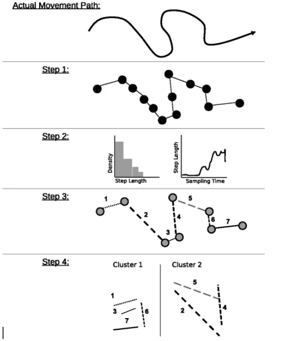
```

## Decoding states

-   In most situation it is not possible to observe the animal continuously and directly refer to different states.
-   Many statistical and machine learning approach exist, that attempt to refer different behavioral states of the animal from location data (see e.g., Edelhoff et al. 2016 for a review).
-   We will have a look at Hidden Markov Models to decode states.

## Hidden Markov Models

-   In the simplest case we have one time series (for example a sequence of step lengths).
-   The observed step lengths originate from two (possibly more) step-length distributions and each step-length distribution resembles a different behavioral state.
-   The challenge that we face is to assigning observations to different step-length distributions.

## The mathematical model

-   We start series of observation $\mathbf{Z}_1, \dots, \mathbf{Z}_T$ and underlying state Sequence $S_1, \dots, S_T$. For a total of $T$ observations.
-   $S_T$ takes values from $1, \dots, N$. For a total of $N$ (behavioral) states.
-   $\mathbf{Z}_t$ is assumed to be drawn from $N$.

```{r, fig.cap="Source: Michelot et al. 2016", echo = FALSE}
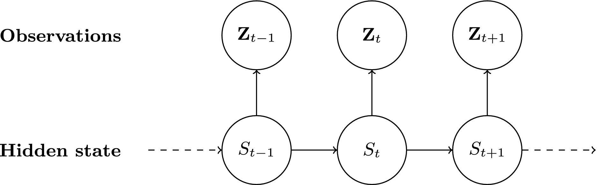
```

------------------------------------------------------------------------

-   Animal movement data usually consists of locations $(x_1, y_1), \dots, (x_T, y_T)$, from which different movement metrics can be calculated (usually step length $l_t$ and turn angle $\phi_t$).
-   Thus the observation process is: $\mathbf{z}_t = (l_t, \phi_t)$.

## Transition between states

The transition between states is described by a matrix $\Gamma^{(t)}$. For a two-state HMM is this

$$
\Gamma^{(t)} = 
\left[ {\begin{array}{cc}
    \gamma_{1,1}^{(t)} & \gamma_{1,2}^{(t)} \\
    \gamma_{2,1}^{(t)} & \gamma_{2,2}^{(t)} \\
  \end{array} } \right]
$$

-   $\gamma_{1,1}^{(t)}$ and $\gamma_{2,2}^{(t)}$ are the probabilities to remain in the first or second state, respectively.
-   $\gamma_{1,2}^{(t)}$ is the probability to change from state one to stat two.
-   $\gamma_{2,1}^{(t)}$ is the probability to change from state one to stat two.
-   *Note, transition probabilities can also be modeled as a function of covariates.*

## How to choose starting values

```{r, echo = FALSE, fig.cap="Figure source: https://cran.r-project.org/web/packages/moveHMM/vignettes/moveHMM-starting-values.pdf"}
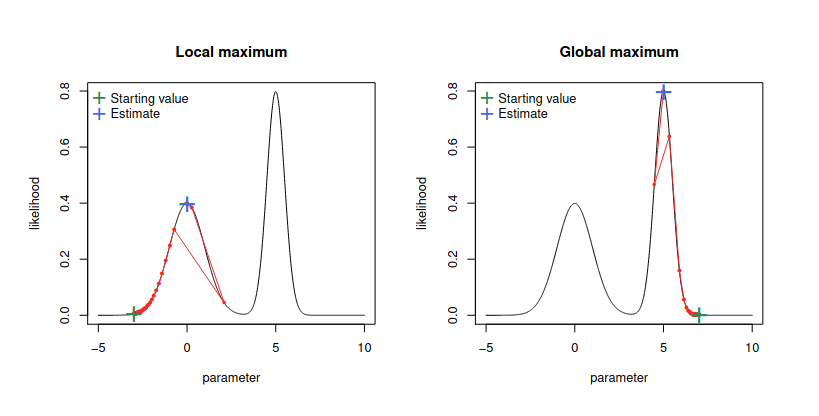
```

HMM use a non linear optimization and is sensitive to different starting values. In order to ensure that you found a global maximum of the likelihood, you need to try different starting values.

## Choosing the correct number of states

-   It is often difficult to determine the correct number of states.
-   Use a mix of statistical tools, biological knowledge and data that is available.
-   Pohle et al. 2017 did extensive simulations suggested a number of steps: <https://link.springer.com/article/10.1007/s13253-017-0283-8#Sec11>.

## An example

Farhadinia *et al.* 2020[^1] used HMMs to analyse movement data of Persian leopards.

[^1]: https://link.springer.com/article/10.1186/s40462-020-0195-z

```{r, echo = FALSE, out.width="90%", fig.align="center"}
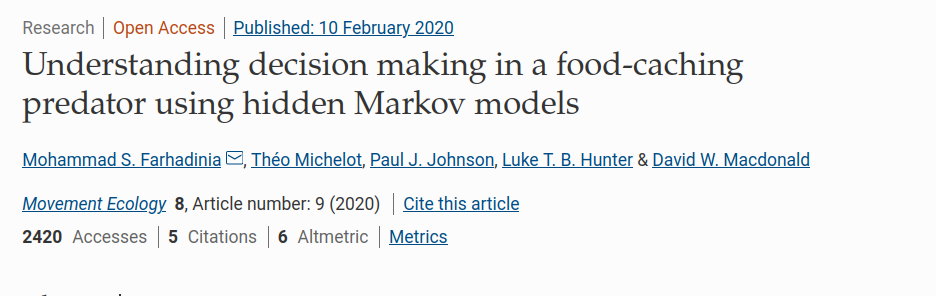
```

------------------------------------------------------------------------

Step-length distributions and turn angle distribution in different behavioral states:

```{r, echo = FALSE, out.width="90%", fig.align="center"}
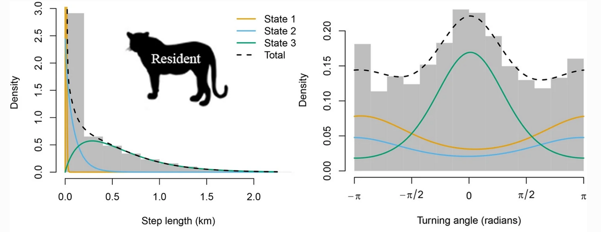
```

-   State 1: Slow and undirected movement
-   State 2: Moderately fast and directed movement
-   State 3: Fast and directed movement

------------------------------------------------------------------------

The transitions between states can be modeled as a function of covariates.

```{r, echo = FALSE, out.width="90%", fig.align="center"}
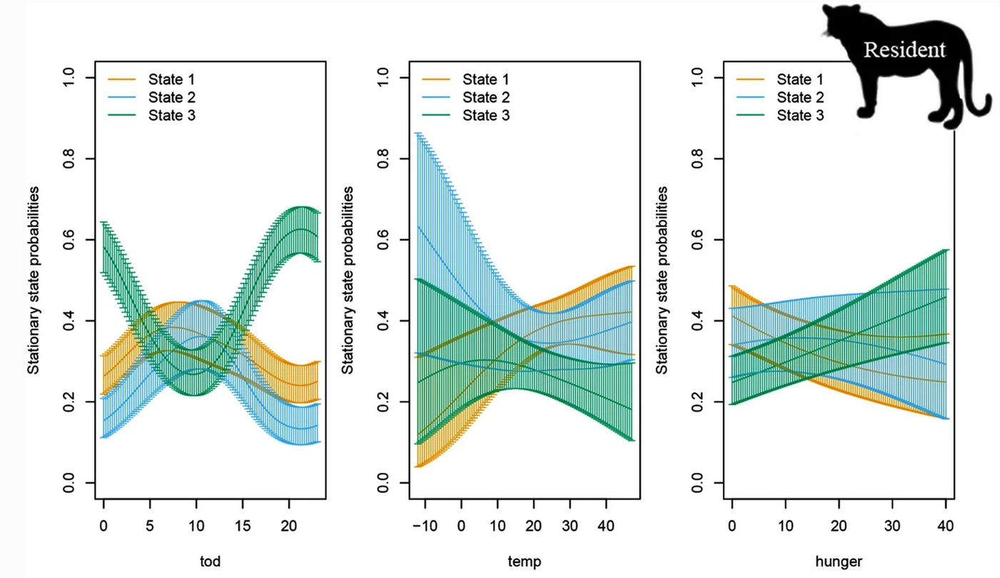
```

# What about habitat selection?

## An integrated approach

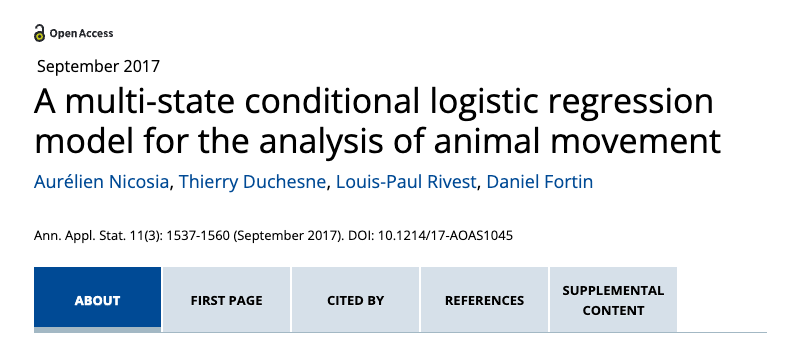

------------------------------------------------------------------------

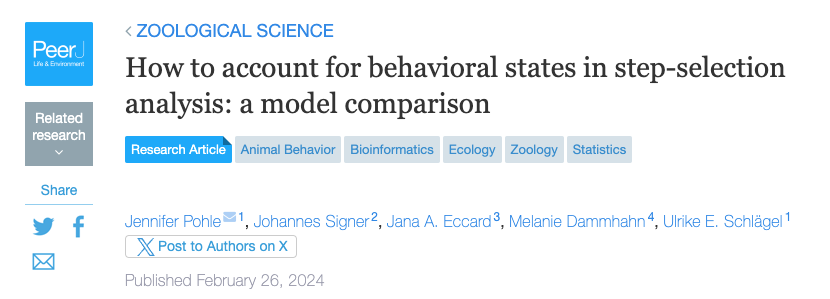{fig-align="center"}

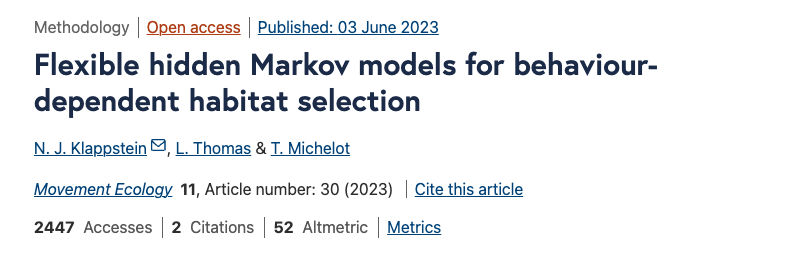{fig-align="center"}

------------------------------------------------------------------------

The idea is to simultaneously fit a Markov-switching variant of the conditional logistic regression:

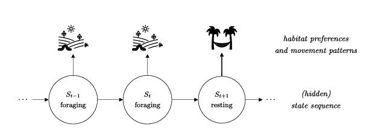

------------------------------------------------------------------------

We can estimate different selection-free movement kernels and state-specific selection parameters without knowing the (hidden) covariate that separates states.

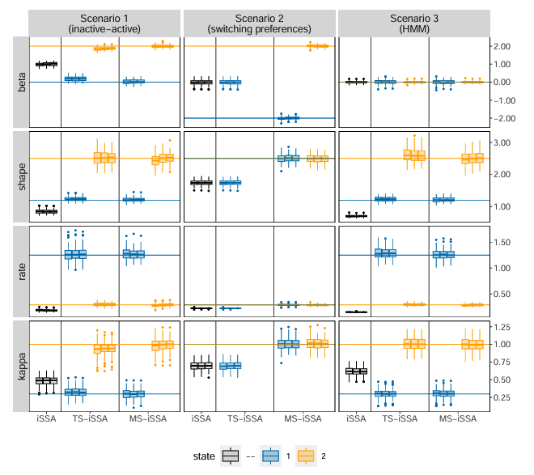

# Irregular sampling rates

## How to deal with gaps

In a recent ppublication Hofmann et al. compared 4 approaches:

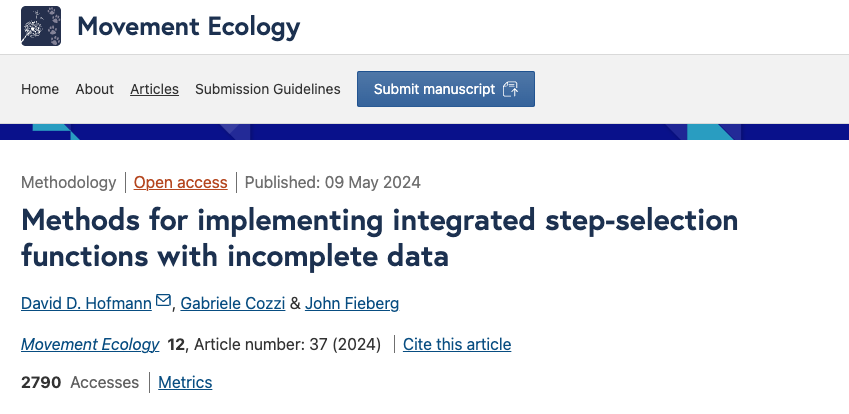

------------------------------------------------------------------------

1.  Imputation using the `crawl` package.
2.  Naive: Following a suggestion Munden et al. 2021 to find turning points and also model duration.
3.  Dynamic+Model: Sample random steps from different tentative distributions.
4.  Multistep: Using multiples of initial step length

------------------------------------------------------------------------

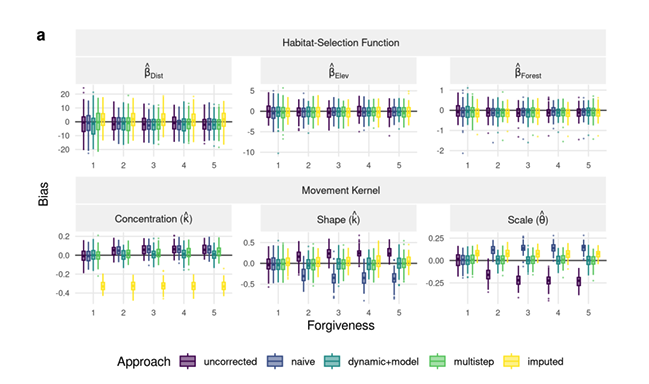
