```{r setup}
#| include: false
library(tidyverse)
library(amt)
library(terra)

knitr::opts_knit$set(
  root.dir = here::here("09 Simulation"))

knitr::opts_chunk$set(
  echo = TRUE,
  warning = FALSE,
  message = FALSE
)
```


# Outline & Motivation

## Background

- Why we need simulations for iSSFs
- How to simulate
- Why to simulate


# Before we start

----

:::: {.columns}

::: {.column width="40%"}

**Think-pair-share**: Can we use a HSF/RSF to predict a possible
path of an animal.

:::
::: {.column width="20%"}
:::

::: {.column width="40%"}

:::{.timer #timer-1 seconds=180 starton=interaction}
:::

:::

::::

# Why we need simulations for SSFs


## H/RSFs and iSSFs

- RSFs: 
  - There is no movement model built in that we can use when simulating space use.
  - It is common practice to multiply coefficients with resources, exponentiate the result, and normalize to obtain a utilization distribution.
  
  
$$
UD(s_j) = \frac{w(s_j)}{\sum_{j = 1}^G w(s_j)} = \frac{\exp(\sum_{i = 1}^n\beta_i x_i(s_j))}{\sum_{j = 1}^G \exp(\sum_{i = 1}^n\beta_i x_i(s_j))}
$$

-----
  
- iSSF: 
  - We have a simple movement model built-in, that allows integration of the movement process.
  - We can no longer simply multiply selection coefficients with resources.

-----

### For iSSFs this is a bit more complicated

If we take the same approach for iSSFs, we introduce a **bias** because
we are neglecting conditional formulation of iSSFs when creating maps.

<div style="text-align:center;">
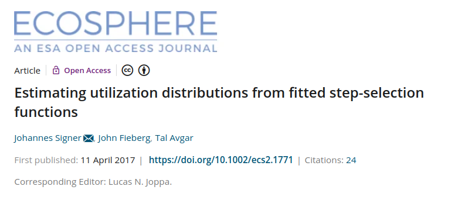
</div>

------------------------------------------------------------------------

:::: {.columns}

::: {.column width="50%"}

We used simulations to compare the two approaches:

-   naive
-   simulation-based

:::
::: {.column width="50%"}

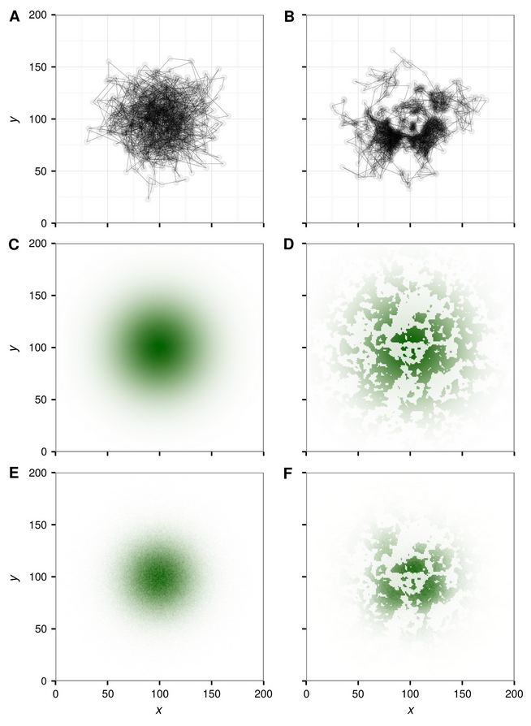

:::

::::


------------------------------------------------------------------------

- Comparison between *true* utilization distribution and simulated utilization distribution:

<div style="text-align:center;">
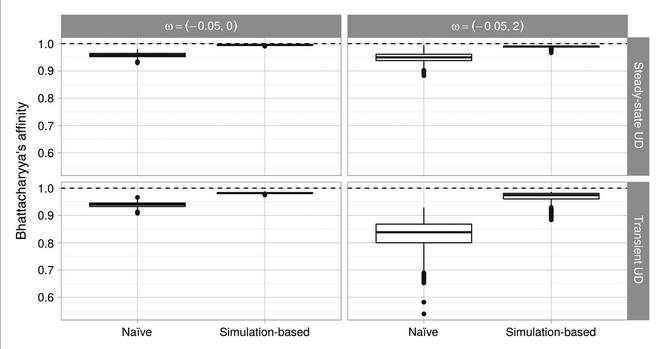
</div>


------------------------------------------------------------------------

- The bias becomes even larger if selection is stronger:

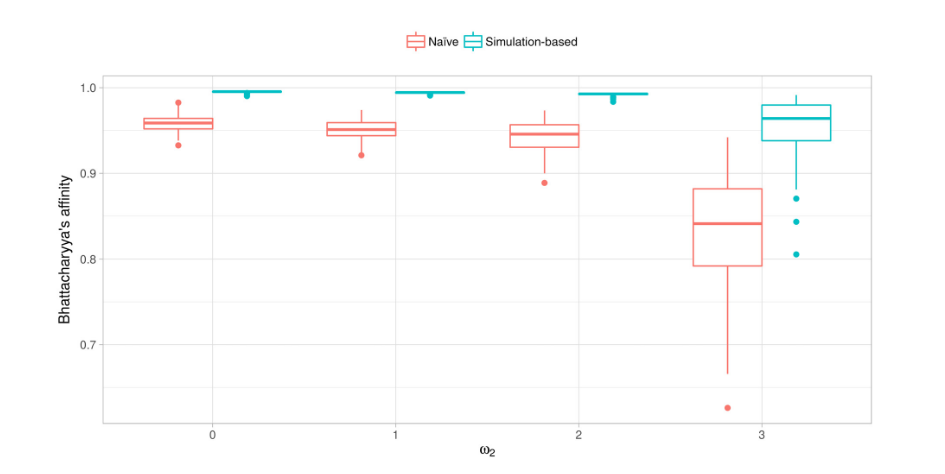


# How to simulate

## The redistribution kernel

\begin{equation*}
{\textcolor{darkblue}{(\mathbf{s}, t + \Delta t)}} {|\textcolor{ligthblue}{u(\mathbf{s}', t)}} \frac{{\textcolor{violet}{w(\mathbf{X}(\mathbf{s});\mathbf{\beta}(\Delta t))}}{\textcolor{darkgreen}{\phi(\theta(\mathbf{s}, \mathbf{s'}), \gamma(\Delta t))}}}
{{\textcolor{grey}{\underbrace{\int_{\tilde{\mathbf{s}} \in G} w(\mathbf{X}( \tilde{\mathbf{s}});\mathbf{\beta}(\Delta t))\phi(\theta(\tilde{\mathbf{s}}, \mathbf{s}');\gamma(\Delta t))d\tilde{\mathbf{s}}}_{\text{Normalizing constant}}}}}
\end{equation*}

We want to model the probability that the animals moves to position
$\textcolor{darkblue}{\mathbf{s}}$ at time
\textcolor{darkblue}{$t + \Delta t$}, given it is at position $\textcolor{lightlbue}{\mathbf{s'}}$ at time $\textcolor{blue!50}{t}$.

## Redistribution Kernel

Try it here:  <https://jmsigner.shinyapps.io/apps/> or start the app locally (`Day4_SSFs_advanced/apps/redistributionkernel.R`)

<div style="text-align:center;">
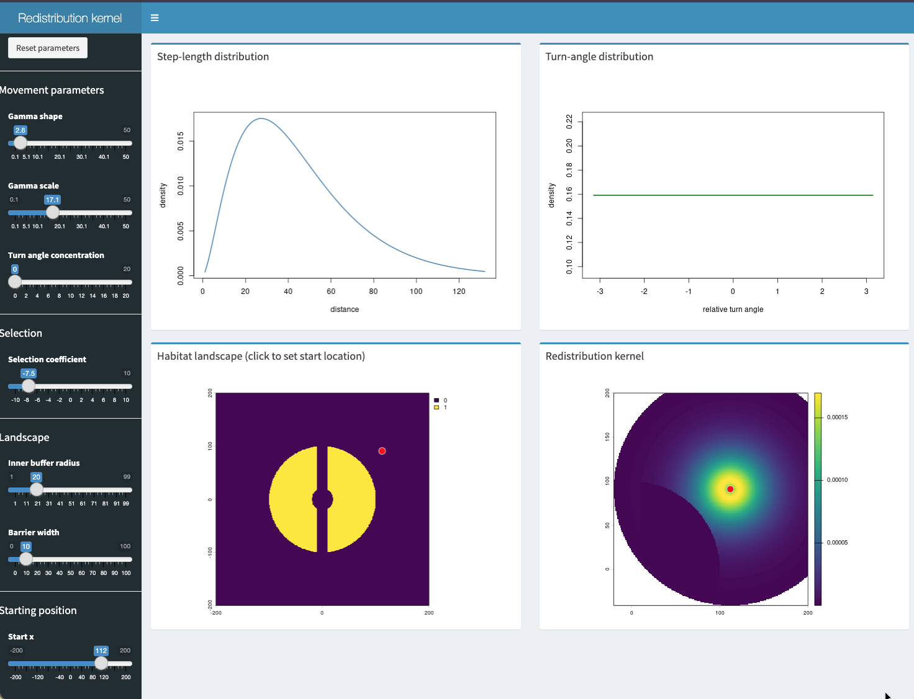
</div>

----

To run the app locally use: 

```{r, eval = FALSE}
shiny::runApp(
  here::here(
  "Day4_SSFs_advanced/01_Simulations/apps/redistributionkernel.R"
  )
)
```


## Implementation in `amt`

In **amt** there is the function `redistribution_kernel()`, with several arguments (some are discussed here): 

```{r, eval = FALSE}
rdk1 <- redistribution_kernel(
  x = m1, 
  map = r1, 
  start = start)
```

---- 

- `x`: This is the model and should be either the result of an iSSF fitted to data with the function `fit_issf()` or a model built from scratch with the function `make_issf_model()`. 

```{r}
m1 <- make_issf_model(
  # the selection coefficients
  coefs = c("x_end" = 1), 
  # sl distribution
  sl = make_gamma_distr(shape = 2, scale = 2), 
  ta = make_vonmises_distr()
)
```

---------

- `map`: This is the landscape (with the resources). This needs to be one or more `SpatRast`s from the **terra** package. 


```{r}
r1 <- terra::rast(xmin = -20, xmax = 20, 
                  ymin = -20, ymax = 20, res = 1)
r1[] <- 1
r1[ , 1:20] <- 0
names(r1) <- "x"
```


- `start`: The start position and start direction. 


```{r, eval = TRUE}
start <- make_start(c(0, 0), ta_ = 0)
```


--------

### Redistribution kernel...

```{r, fig.width=2, dpi = 600}
rdk1 <- redistribution_kernel(
  m1, map = r1, start = start, as.rast = TRUE)
```

:::: {.columns}

::: {.column width="50%"}

:::{.fragment}


:::

:::

::: {.column width="50%"}

:::{.fragment}
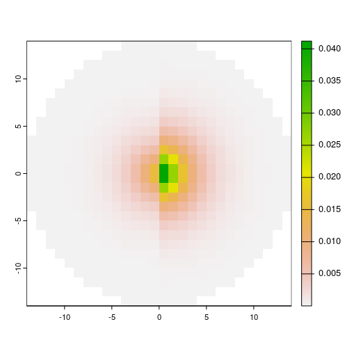
:::
:::
::::


--------

### ... as a function of the current position of the animal

```{r}
rdk2 <- redistribution_kernel(
  m1, map = r1, start = make_start(c(10, 0)), as.rast = TRUE)
```


:::: {.columns}

::: {.column width="50%"}
:::{.fragment}
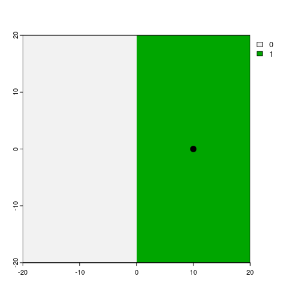
:::
:::

::: {.column width="50%"}
:::{.fragment}
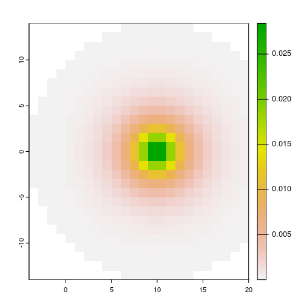
:::
:::
::::

## More details

<div style="text-align:center;">
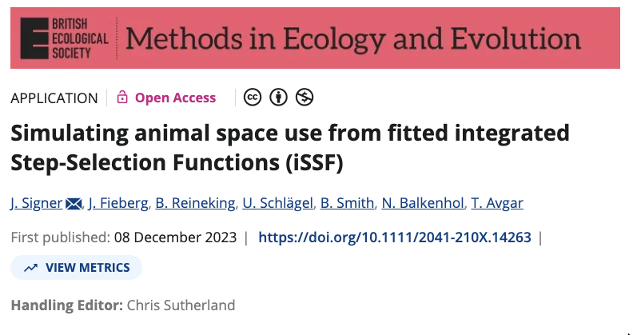
</div>

# Why to simulate

::: {.fragment}
- Understanding the model that you use
- Model validation
- Where will the animal be next?
- Use fitted SSFs for connectivity analyses
:::

## Understanding the model that you use

Here relatively simple scenarios can be explored

{width=70% fig-align="center"}

---- 

What about?

The model specification can be abstract, e.g., what does the interaction between a covariate at the start of a step and the cosine of the turn angle mean?


For example: $\sim \beta_1 \cos(\text{ta}) x_\text{start}$

-------

What how does the redistribution kernel for $\sim \beta_1 \cos(\text{ta}) x_\text{start}$ look, if $\beta_1 = -4$?


::: {.fragment}

```{r, echo = FALSE}
r <- rast(xmin = -10, xmax = 10, ymin = -10, ymax = 10, res = 0.05)
r[] <- 0
p <- terra::vect(cbind(c(1, 1, 6, 6, 1), c(-4, 4, 4, -4, -4)), type = "polygon")
r <- rasterize(p, r, background = 0)
names(r) <- "x"

m1 <- make_issf_model(
  coefs = c("cos(ta_):x_start" = -5),
  sl = make_gamma_distr(2, 2), 
  ta = make_vonmises_distr(kappa = 5))
                
rk <- redistribution_kernel(
  m1, start = make_start(c(0, 0), ta_ = 0), 
  map = r, as.rast = TRUE, max.dist = 5, 
  landscape = "discrete",
  tolerance.outside = 0.2)

op <- par(mfrow = c(1, 2))
plot(r, legend = FALSE)
points(0, 0, cex = 2, pch = 20)
plot(rk$redistribution.kernel, legend = FALSE)
```

:::

------------

Same model, but a different position in geographic space.

::: {.fragment}

```{r, echo = FALSE}
rk <- redistribution_kernel(m1, start = make_start(c(2, 0), ta_ = 0), 
                            landscape = "discrete", tolerance.outside = 0.2,
                            map = r, as.rast = TRUE, max.dist = 5)

op <- par(mfrow = c(1, 2))
plot(r, legend = FALSE)
points(2, 0, cex = 2, pch = 20)
plot(rk$redistribution.kernel, legend = FALSE)
```

:::

-----

What if the animal shows a preference for $x$? E.g., $\sim \beta_1 \cos(\text{ta}) x_\text{start} + \beta_2x_\text{end}$ and $\beta_2 = 2$.


::: {.fragment}

```{r, echo = FALSE}
m1 <- make_issf_model(
  coefs = c("cos(ta_):x_start" = -5, "x_end" = 2),
  sl = make_gamma_distr(2, 2), 
  ta = make_vonmises_distr(kappa = 5))
                
op <- par(mfrow = c(1, 2))
rk <- redistribution_kernel(m1, start = make_start(c(0, 0), ta_ = 0), 
                            landscape = "discrete", tolerance.outside = 0.2,
                            map = r, as.rast = TRUE, max.dist = 5)
plot(r, legend = FALSE)
points(0, 0, cex = 2, pch = 20)
plot(rk$redistribution.kernel, legend = FALSE)
```

:::

-----------

Same model, but different starting position. 

```{r, echo = FALSE}
rk <- redistribution_kernel(m1, start = make_start(c(2, 0), ta_ = 0), 
                            map = r, as.rast = TRUE, max.dist = 5, 
                            landscape = "discrete", tolerance.outside = 0.2)
op <- par(mfrow = c(1, 2))
plot(r, legend = FALSE)
points(2, 0, cex = 2, pch = 20)
plot(rk$redistribution.kernel, legend = FALSE)

```


## Model validation


To illustrate the use of simulation, we fitted an iSSF to tracking data
of a single African buffalo\footnotemark\textsuperscript{,}\footnotemark.

We fitted three different models using \texttt{amt}:

::: {.incremental}
- **Base model:** `case_ ~ cos(ta_) + sl_ + log(sl_) + water_dist_end`
- **Home-range model:** <code>case_ ~ cos(ta_) + sl_ + log(sl_) + water_dist_end + </code> <code style="color:green;">x2_ + y2_ + I(x2_^2 + y2_^2)</code>
- **River model:** <code>case_ ~ cos(ta_) + sl_ + log(sl_) + water_dist_end + x2_ + y2_ + I(x2_^2 + y2_^2) + </code>
<code style="color:green;">I(water_crossed_end != water_crossed_start)</code>

:::

-----

- For details of the data see: Getz et al. 2007 LoCoH: Nonparameteric kernel methods for constructing home ranges and utilization distributions. PLoS ONE
- Cross et al. 2016. Data from: Nonparameteric kernel methods for constructing home ranges and utilization distributions. Movebank Data Repository. DOI:10.5441/001/1.j900f88t.

------------------------------------------------------------------------


:::: {.columns}

::: {.column width="50%"}

The landscape

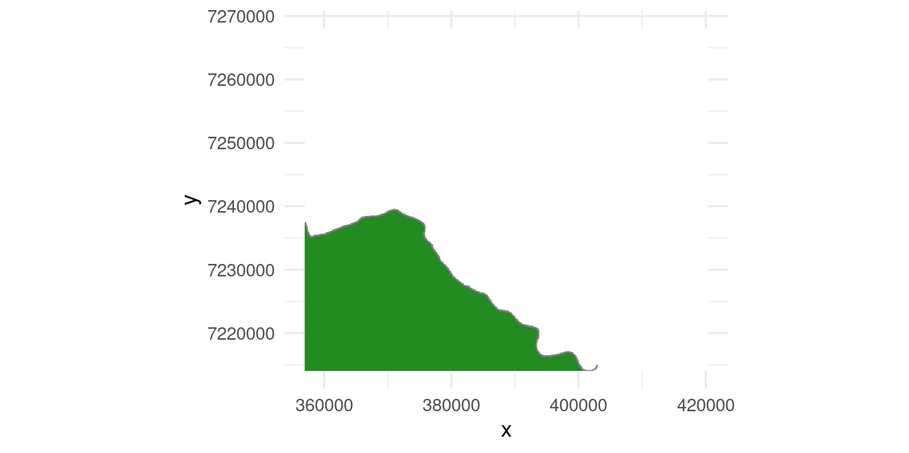

:::

::: {.column width="50%"}

::: {.fragment}

The observed track

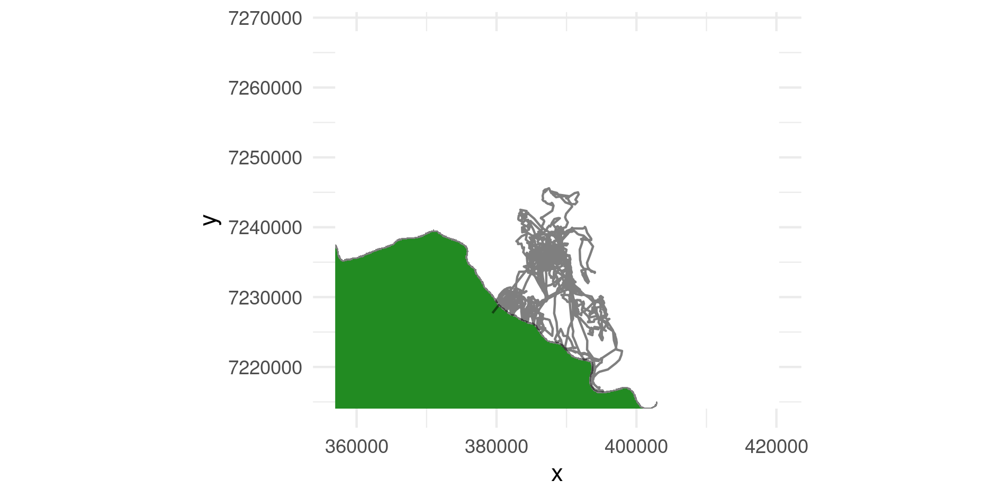
:::

:::

::::

-----------


**Base model:** `case_ ~ cos(ta_) + sl_ + log(sl_) + water_dist_end`

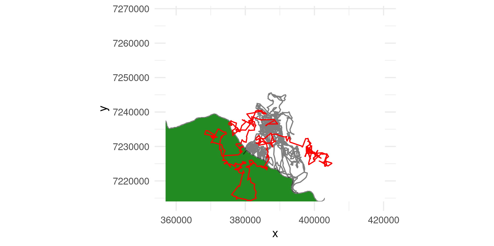

---------

**Home-range model:** <code>case_ ~ cos(ta_) + sl_ + log(sl_) + water_dist_end + </code> <code style="color:green;">x2_ + y2_ + I(x2_^2 + y2_^2)</code>

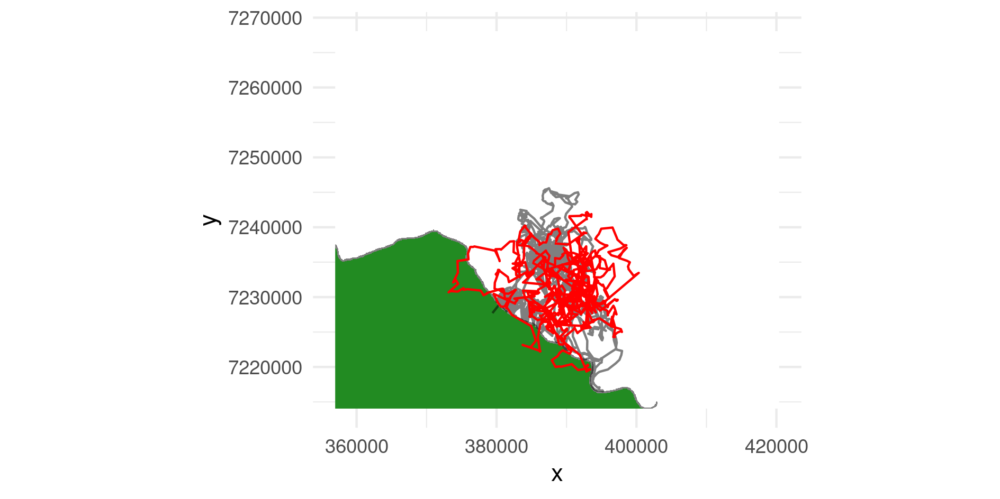

--------

**River model:** <code>case_ ~ cos(ta_) + sl_ + log(sl_) + water_dist_end + x2_ + y2_ + I(x2_^2 + y2_^2) + </code>
<code style="color:green;">I(water_crossed_end != water_crossed_start)</code>

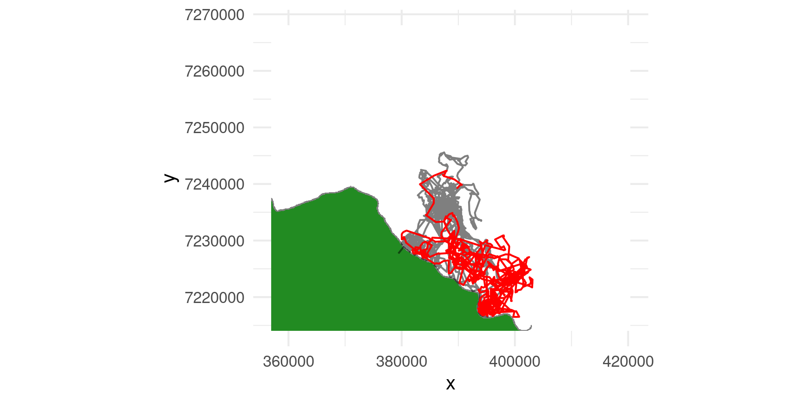

-----

A much better way to approach this: 

<div style="text-align:center;">
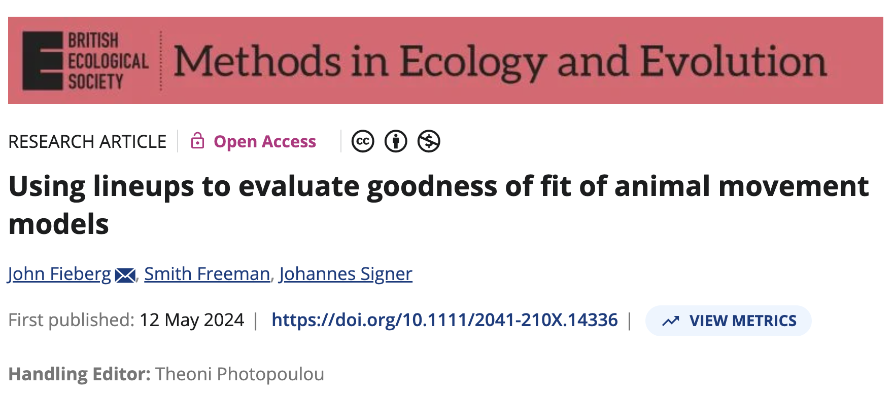
</div>


## Where will the animal be next?

Predicting the position of the animal in the future from a redistribution kernel.

1. First we need to create a slightly bigger landscape. 

```{r}
r <- terra::rast(xmin = -100, xmax = 100, 
                 ymin = -100, ymax = 100, res = 1)
r[] <- 0
r[50:100, ] <- 1
names(r) <- "x"
```

-------

2. Then we have to specify the redistribution kernel again

```{r}
# Start
start <- make_start(c(0, 0), ta_ = pi/2)

# Model
m <- make_issf_model(
  coefs = c(x_end = 2), 
  sl = make_gamma_distr(shape = 2, scale = 2), 
  ta = make_vonmises_distr(kappa = 1))

# Redistribution kernel
rdk.1a <- redistribution_kernel(
  m, start = start, map = r, 
  landscape = "continuous", max.dist = 5, 
  n.control = 1e4)
```

-------

And now we simulate 15 steps from this redistribution kernel:

```{r}
p1 <- simulate_path(rdk.1a, n.steps = 15, start = start)
```

```{r, echo = FALSE}
ggplot(p1, aes(x_, y_)) + geom_path() + coord_equal() +
  theme_minimal(base_size = 13)
```


--------------

But this is just one realization; let's repeat this for $n = 50$ animals:

```{r simulate}
#| cache: true 
n <- 50
system.time(p1 <- replicate(
  n, simulate_path(rdk.1a, n = 15, 
                   start = start), 
  simplify = FALSE))
```


-------------------

Paths of 50 simulated animals

```{r, echo = FALSE}
# Plot 1
tibble(
  rep = 1:n, 
  path = p1
) |> unnest(cols = path) |> 
  ggplot(aes(x_, y_, group = rep)) + geom_path(alpha = 0.1) +
  coord_equal() +
  theme_minimal(base_size = 13)
```

## What can we do with this

:::: {.columns}

::: {.column width="50%"}
### What is a UD

> The **utilization distribution** (UD) is "a probability distribution ... for the use of space with respect to time. That is, the utilization distribution usually calculated shows the probabilities of where an animal might have been found at any randomly chosen *time*."

— Powell and Mitchell 2012 (<https://doi.org/10.1644/11-MAMM-S-177.1>)
:::

::: {.column width="50%"}

:::: {.fragment}

### Types of UDs

We distinguish between two different types of Utilization Distributions (UDs):

1.  Transient UD (TUD) is the expected space-use distribution over a
    short time period and is thus sensitive to the initial conditions
    (e.g., the starting point).
2.  Steady-state UD (SSUD) is the long-term (asymptotically infinite)
    expectation of the space-use distribution across the landscape.


::::

:::

::::


## From a redistribution kernel to a map


```{r, echo = FALSE}
map(p1, ~ mutate(.x, ts = row_number())) |> 
  bind_rows() |> 
  filter(ts %in% c(2, 5, 10, 15)) |> 
  ggplot(aes(x_, y_)) + geom_point(alpha = .1) + 
  facet_wrap(~ ts) + coord_equal() +
  theme_minimal(base_size = 13)
  
```

-------

```{r, echo = FALSE}
trks <- lapply(c(2, 5, 10, 15), function(i) {
  tibble(
    rep = 1:n, 
    path = map(p1, ~ dplyr::slice(.x, i))
  ) |> unnest(cols = path) |> 
    make_track(x_, y_) |> hr_kde(trast = r)
})
plts <- terra::rast(lapply(trks, hr_ud))
names(plts) <- paste("n =", c("2", "5", "10", "15"))
terra::plot(plts)
```

## Use fitted SSFs for connectivity analyses

<div style="text-align:center;">
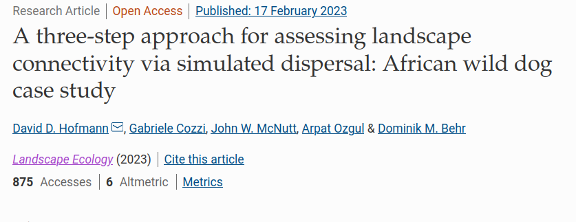
</div>


# Thank you - Happy to take questions